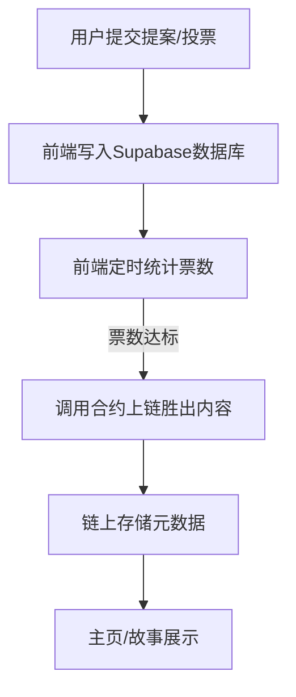
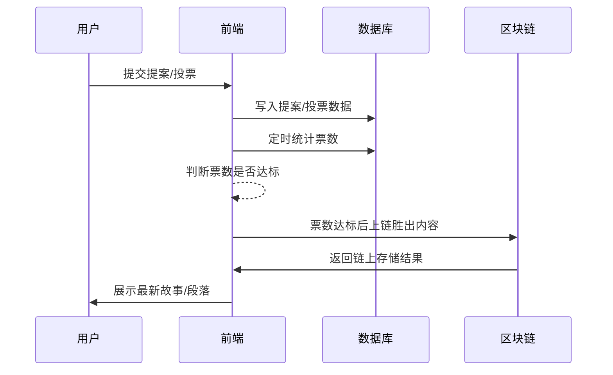

# NarrFlow (叙事流) - 去中心化协作创作平台

## 项目概述
NarrFlow是一个基于区块链技术的去中心化协作小说创作平台，通过代币经济模型和投票机制，让用户共同参与创作过程。

## 现行方案说明
- 所有投票行为和票数统计均在前端通过数据库（Supabase）进行。
- 前端定时统计票数，一旦某个提案票数达到阈值，自动将该内容通过合约写入链上。
- 链上只存储最终胜出的内容元数据（如内容哈希、作者等），不再存储所有投票细节。
- 正文内容链下存储，链上仅存元数据。

## 核心功能
### 基础玩法机制
- 用户（Writer）通过铸造NF币获取编辑权限
- 可以自主创作标题或段落
- 对他人作品进行投票（禁止自投）
- 所有创作内容可公开浏览

### 详细执行流程
1. 收集标题并在规定时间内投票（所有提案和投票数据存数据库）
2. 前端统计票数，票数最高的标题自动上链并发布到主页
3. 开始收集段落并进行投票（同上）
4. 段落投票结果胜出后上链并更新主页
5. 开启下一轮投票
6. 完成指定段落数后自动整理成全文并上链存储
7. 开启新一轮标题投票
8. 循环往复

## 技术架构

### 智能合约层
- 只负责存储最终胜出的内容元数据（如内容哈希、作者、投票数等）
- 负责奖励发放、内容归档等

### 前端+数据库层
- 负责所有提案、投票、票数统计、胜出判断
- 通过Supabase存储所有提案和投票数据
- 票数达标后自动调用合约上链

### 架构流程图

## 技术栈实现方案

### 智能合约层 (Move on Sui)
- 合约模块设计
  - story.move：负责故事与段落管理、归档、奖励
  - token.move：负责NARR代币管理与奖励
  - narr_flow.move：聚合业务逻辑
- 只存元数据，不存正文和投票过程

### 前端技术栈
- React 18 + TypeScript
- TailwindCSS
- Redux Toolkit
- Supabase（数据库）
- @suiet/wallet-kit（钱包集成）

### API层设计
- 链上接口
  - createStory(title, contentHash): Promise<string>
  - submitParagraph(storyId, contentHash, preview): Promise<void>
  - vote(storyId, paragraphId): Promise<void>
  - getStoryDetails(storyId): Promise<StoryDetails>
- 数据库接口
  - 提案增删查改
  - 投票增删查改
  - 票数统计

### 存储方案
- 链上存储：故事元数据、投票结果、用户奖励
- 数据库存储：所有提案、投票、票数统计
- 正文内容链下存储（如对象存储、数据库等）

### 部署架构
- 前端部署：静态资源托管（如Vercel、Netlify等）
- 数据库：Supabase
- 区块链：Sui主网

### 开发工具链
- Sui Move CLI
- Node.js 18+
- TypeScript 5.0+
- Supabase CLI

## 逻辑流程演示

## 结语
本方案兼顾了性能、成本与安全性，极大提升了用户体验和系统可扩展性。