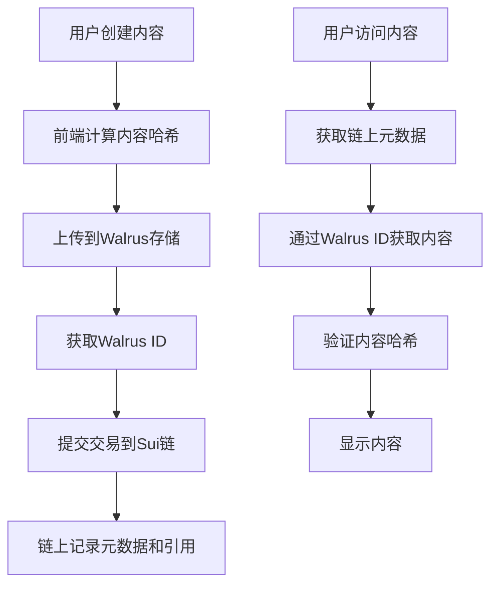

# NarrFlow (叙事流) - 去中心化协作创作平台

## 项目概述
NarrFlow是一个基于区块链技术的去中心化协作小说创作平台，通过代币经济模型和投票机制，让用户共同参与创作过程。

## 待解决的核心问题
- Gas费用如何支付和优化？
- 如何确保投票的公平性？
- 如何处理并发投票情况？
- 如何优化链上存储成本？

## 核心功能
### 基础玩法机制
- 用户（Writer）通过铸造NF币获取编辑权限
- 可以自主创作标题或段落
- 对他人作品进行投票（禁止自投）
- 所有创作内容可公开浏览

### 详细执行流程
1. 收集标题并在规定时间内投票
2. 标题投票完成后上链并发布到主页
3. 开始收集段落并进行投票
4. 段落投票结果上链并更新主页
5. 开启下一轮投票
6. 完成20个段落后自动整理成全文并上链存储
7. 开启新一轮标题投票
8. 循环往复

## 技术架构

### 智能合约层
1. 内容管理合约
   - 负责收取提交的段落和标题
   - 存储投票数据
   - 确保内容可追溯性

2. 投票统计合约
   - 对提交的段落/标题进行计票统计
   - 实现投票权重计算
   - 处理投票结果验证

### 前端架构
1. 主要功能
   - 收集标题和段落
   - 发送数据到区块链
   - 显示所有提交的段落
   - 展示投票数据
   - 自动整合高票段落

2. 用户界面
   - 创作界面
   - 投票界面
   - 作品展示页
   - 个人中心

## 技术栈实现方案

### 智能合约层 (Move on Sui)
1. 合约模块设计
   ```move
   module narr_flow::content {
       // 内容存储结构
       struct Story has key {
           id: ID,
           title: String,
           paragraphs: vector<Paragraph>,
           status: u8,
           votes: Table<address, u64>
       }
       
       struct Paragraph has store {
           walrus_id: vector<u8>,      // Walrus存储ID
           content_hash: vector<u8>,    // 内容哈希值
           preview: String,             // 内容预览
           author: address,
           vote_count: u64
       }
   }
   
   module narr_flow::token {
       // NF代币实现
       struct NFToken has drop {
           value: u64
       }
   }
   
   module narr_flow::voting {
       // 投票逻辑实现
   }
   ```

2. 核心功能实现
   - 利用Sui Move的Object模型管理故事内容
   - 使用Table存储投票数据
   - 实现代币铸造和转账功能
   - 设计投票权重计算逻辑

3. 性能优化
   - 使用Sui的并行执行特性优化交易处理
   - 实现批量操作以减少Gas消耗
   - 利用Object-Centric存储模型优化数据访问
   - 使用Walrus存储大容量内容降低链上存储成本

### 前端技术栈
1. 框架选择
   - 主框架：React 18
   - 状态管理：Redux Toolkit
   - UI组件库：自定义组件 + TailwindCSS
   - Web3集成：sui-kit.js
   - 托管平台：Walrus Sites

2. 项目结构
   ```
   src/
   ├── components/
   │   ├── Story/
   │   ├── Vote/
   │   └── Writer/
   ├── pages/
   │   ├── Home/
   │   ├── Create/
   │   └── Vote/
   ├── hooks/
   │   ├── useSui.ts
   │   ├── useWalrus.ts
   │   └── useVote.ts
   ├── store/
   │   └── index.ts
   └── services/
       ├── walrus.ts
       └── api.ts
   ```

3. 关键功能实现
   - 使用React Hooks封装Sui Move合约调用
   - 实现实时投票状态更新
   - 集成Walrus存储长文本内容
   - 实现富文本编辑器
   - 利用SuiNS实现友好的URL访问

4. 性能优化
   - 使用React.memo优化组件重渲染
   - 实现数据缓存和预加载
   - 使用Web Workers处理复杂计算

### API层设计
1. 链上接口
   ```typescript
   interface StoryContract {
     createStory(title: string, walrusId: string, contentHash: string): Promise<string>;
     submitParagraph(storyId: string, walrusId: string, contentHash: string, preview: string): Promise<void>;
     vote(storyId: string, paragraphId: string): Promise<void>;
     getStoryDetails(storyId: string): Promise<StoryDetails>;
   }
   ```

2. Walrus接口
   ```typescript
   interface WalrusService {
     uploadContent(content: string): Promise<{walrusId: string, contentHash: string}>;
     getContent(walrusId: string): Promise<string>;
     verifyContent(walrusId: string, contentHash: string): Promise<boolean>;
   }
   ```

### 存储方案
1. 链上存储
   - 故事元数据
   - 投票记录
   - 用户权限数据
   - 内容哈希和Walrus ID

2. Walrus存储
   - 段落详细内容
   - 完整故事文本
   - 用户头像和资料
   - 前端应用托管

3. 混合存储优势
   - 减少85-95%的链上存储成本
   - 确保内容永久可访问性
   - 支持大量文本和媒体内容
   - 内容验证通过哈希确保完整性

### 部署架构
1. 前端部署
   - 使用Walrus Sites托管前端应用
   - 注册SuiNS域名（narrflow.wal.app）
   - 为每个故事创建专属URL

2. 内容服务
   - 利用Walrus高可用性分布式存储
   - 多节点数据备份确保内容安全
   - 内容哈希验证确保完整性

### 开发工具链
1. 开发环境
   - Sui Move CLI
   - Node.js 18+
   - TypeScript 5.0+
   - Vite构建工具
   - Walrus site-builder

2. 测试框架
   - Jest单元测试
   - Cypress E2E测试
   - Move测试框架

3. CI/CD
   - GitHub Actions
   - 自动部署到Walrus Sites
   - 自动化测试和部署

## 改进建议

### 经济模型优化
1. 代币机制
   - 设计合理的NF代币发行机制
   - 建立通证经济闭环
   - 引入质押机制增加参与门槛

2. 激励机制
   - 为优质创作提供额外奖励
   - 设计早期参与者激励计划
   - 引入创作者版税分成

### 治理机制
1. 内容质量控制
   - 引入社区审核机制
   - 设置内容质量标准
   - 建立举报和仲裁系统

2. 反作弊机制
   - 防止投票操纵
   - 账号信用评级
   - 惩罚机制设计

### 技术优化建议
1. 存储优化
   - 采用链上元数据+Walrus内容存储的混合方案
   - 实现内容哈希验证机制
   - 优化Gas费用
   - 使用Walrus Sites的专属页面功能

2. 性能提升
   - 实现批量投票处理
   - 优化智能合约调用
   - 预加载热门内容提升访问速度

### 用户体验提升
1. 创作体验
   - 提供富文本编辑器
   - 支持多语言创作
   - 添加写作辅助工具
   - 实现实时内容预览

2. 社交功能
   - 作者关注机制
   - 评论和打赏系统
   - 创作者社区
   - 为每个作者提供专属页面

## 发展路线图

### 第一阶段：MVP (已完成)
- 完成基础智能合约开发
- 实现核心创作和投票功能
- 发布测试网络版本

### 第二阶段：Walrus集成 (进行中)
- 整合Walrus存储解决方案
- 实现内容哈希验证机制
- 部署前端到Walrus Sites
- 注册SuiNS域名

### 第三阶段：功能扩展
- 添加多媒体内容支持
- 实现NFT集成
- 完善社区治理功能
- 优化移动端体验

### 第四阶段：生态建设
- 开放API接口
- 推出创作者激励计划
- 建立社区治理DAO
- 引入AI辅助创作功能

## 技术特点

### Walrus优势分析
1. **原生集成**: 作为Sui生态的存储解决方案，与智能合约无缝对接
2. **高可用性**: 去中心化存储保证内容不会丢失
3. **前端托管**: Walrus Sites简化了项目部署流程
4. **用户体验**: 读取和显示内容速度更快，支持专属页面
5. **链生态**: 完全在Sui生态内运行，不依赖外部系统

### 存储流程设计


### 总体评估
Walrus存储解决方案为NarrFlow项目提供了理想的技术基础，既确保了内容的去中心化存储和永久可访问性，又大幅降低了链上存储成本，是项目技术架构的最佳选择。

## 风险控制

1. 技术风险
   - 智能合约安全审计
   - 定期代码审查
   - 应急响应机制

2. 运营风险
   - 社区监督机制
   - 内容审核标准
   - 用户行为规范

3. 市场风险
   - 代币价格稳定机制
   - 流动性管理
   - 社区激励可持续性

## 注意事项
- 确保每个创作环节的公平性
- 保持投票机制的透明度
- 注重用户隐私保护
- 维护社区创作质量