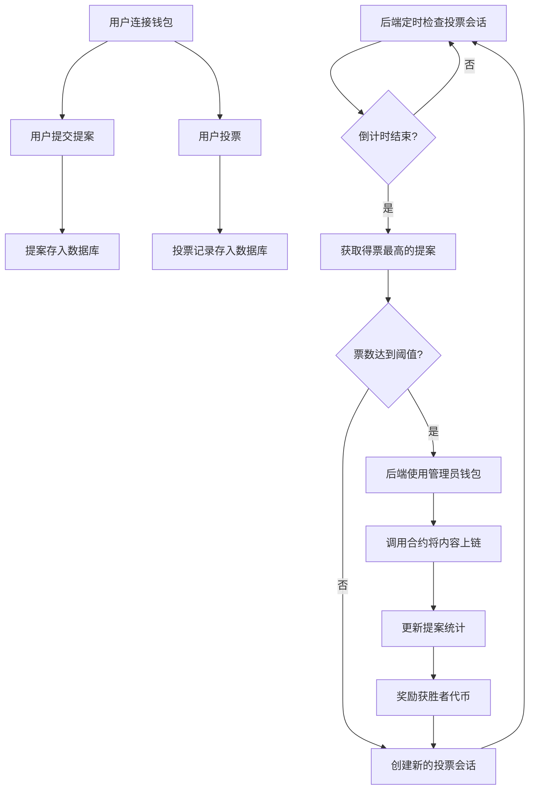
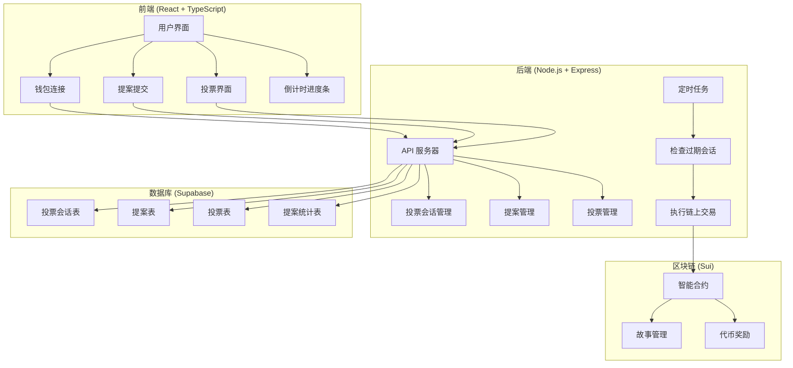

# NarrFlow - 协作叙事平台

NarrFlow 是一个基于区块链技术的去中心化协作小说创作平台，允许用户共同创作故事并获得代币奖励。平台支持故事创建、段落添加、投票决策，结合了创作自由与社区共识机制。

## 最新架构说明
- 采用前后端分离架构，后端使用 Node.js + Express + TypeScript
- 所有投票行为和票数统计通过后端服务器处理，数据存储在 Supabase 数据库中
- 后端定时检查投票会话，当倒计时结束时，自动将得票最高的提案通过合约写入链上
- 链上只存储最终胜出的内容（标题、段落），不存储投票细节
- 提案创建者和获胜者可获得代币奖励

## 功能特性
- **协作创作**：多人参与故事创作，共同决定情节发展
- **投票机制**：社区投票选出最佳段落提案，确保高质量内容
- **代币奖励**：创作者和参与者可获得代币奖励
- **链上治理**：投票和决策透明，永久记录在区块链上
- **倒计时投票**：带有可视化进度条的倒计时投票机制
- **移动友好**：响应式设计，支持多端访问
- **多语言支持**：内置中英文界面切换

## 技术栈
### 前端技术
- React 18 + TypeScript
- TailwindCSS
- Vite
- @mysten/slush-wallet (钱包连接)

### 后端技术
- Node.js + Express
- TypeScript
- @mysten/sui SDK
- Supabase (数据库)
- node-cron (定时任务)

### 区块链技术
- 智能合约：Move on Sui
- 网络：Sui Testnet/Mainnet

## 智能合约模块
- **story.move** - 故事与段落管理
- **treasury.move** - 代币和奖励系统

## 存储策略
- 链上存储：书籍标题、段落内容、作者地址
- 数据库存储：投票会话、提案、投票记录、提案统计

## 项目逻辑流程图


## 部署指南

### 前置条件
- Node.js 18+ 和 pnpm
- Sui CLI 工具
- Supabase 账户
- 管理员钱包（用于执行链上交易）

### 步骤 1: 部署智能合约
```bash
# 切换到合约目录
cd move

# 编译合约
sui move build

# 部署合约到测试网或主网
sui client publish --gas-budget 100000000
```

部署后记录以下信息：
- Package ID
- StoryBook ID
- Treasury ID

### 步骤 2: 设置 Supabase 数据库
1. 创建 Supabase 项目
2. 执行以下 SQL 语句创建必要的表：

```sql
-- 创建投票会话表
CREATE TABLE IF NOT EXISTS public.voting_sessions (
  id UUID PRIMARY KEY DEFAULT uuid_generate_v4(),
  type TEXT NOT NULL CHECK (type IN ('title', 'paragraph')),
  status TEXT NOT NULL CHECK (status IN ('active', 'completed', 'failed')),
  expires_at TIMESTAMP WITH TIME ZONE NOT NULL,
  notes TEXT,
  created_at TIMESTAMP WITH TIME ZONE NOT NULL DEFAULT NOW(),
  updated_at TIMESTAMP WITH TIME ZONE NOT NULL DEFAULT NOW()
);

-- 创建提案表
CREATE TABLE IF NOT EXISTS public.proposals (
  id UUID PRIMARY KEY DEFAULT uuid_generate_v4(),
  content TEXT NOT NULL,
  author TEXT NOT NULL,
  type TEXT NOT NULL CHECK (type IN ('title', 'paragraph')),
  votes INTEGER NOT NULL DEFAULT 0,
  created_at TIMESTAMP WITH TIME ZONE NOT NULL DEFAULT NOW()
);

-- 创建投票表
CREATE TABLE IF NOT EXISTS public.votes (
  id UUID PRIMARY KEY DEFAULT uuid_generate_v4(),
  proposal_id UUID NOT NULL REFERENCES public.proposals(id) ON DELETE CASCADE,
  voter TEXT NOT NULL,
  created_at TIMESTAMP WITH TIME ZONE NOT NULL DEFAULT NOW(),
  UNIQUE(voter)
);

-- 创建提案统计表
CREATE TABLE IF NOT EXISTS public.proposal_stats (
  id UUID PRIMARY KEY DEFAULT uuid_generate_v4(),
  author TEXT NOT NULL UNIQUE,
  proposals_submitted INTEGER NOT NULL DEFAULT 0,
  proposals_won INTEGER NOT NULL DEFAULT 0,
  votes_received INTEGER NOT NULL DEFAULT 0,
  tokens_earned INTEGER NOT NULL DEFAULT 0,
  created_at TIMESTAMP WITH TIME ZONE NOT NULL DEFAULT NOW(),
  updated_at TIMESTAMP WITH TIME ZONE NOT NULL DEFAULT NOW()
);

-- 创建索引
CREATE INDEX IF NOT EXISTS idx_proposals_type ON public.proposals(type);
CREATE INDEX IF NOT EXISTS idx_proposals_author ON public.proposals(author);
CREATE INDEX IF NOT EXISTS idx_votes_proposal_id ON public.votes(proposal_id);
CREATE INDEX IF NOT EXISTS idx_votes_voter ON public.votes(voter);
CREATE INDEX IF NOT EXISTS idx_proposal_stats_author ON public.proposal_stats(author);
CREATE INDEX IF NOT EXISTS idx_voting_sessions_status ON public.voting_sessions(status);
CREATE INDEX IF NOT EXISTS idx_voting_sessions_expires_at ON public.voting_sessions(expires_at);

-- 创建一个活跃的投票会话
INSERT INTO public.voting_sessions (type, status, expires_at, created_at, updated_at)
VALUES ('title', 'active', NOW() + INTERVAL '5 minutes', NOW(), NOW());
```

3. 记录 Supabase URL 和 API Key

### 步骤 3: 配置环境变量
在项目根目录创建 `.env` 文件：

```bash
# 区块链配置
VITE_PACKAGE_ID=你的包ID
VITE_STORYBOOK_ID=你的StoryBook对象ID
VITE_TREASURY_ID=你的Treasury对象ID
VITE_SUI_NETWORK=testnet  # 或 mainnet

# 数据库配置
VITE_SUPABASE_URL=你的Supabase URL
VITE_SUPABASE_KEY=你的Supabase API Key

# 后端配置
PORT=3001
VOTING_COUNTDOWN_SECONDS=300  # 投票倒计时（秒）
VOTE_THRESHOLD=2  # 投票阈值

# 管理员钱包私钥（用于执行链上交易）
ADMIN_PRIVATE_KEY=你的管理员钱包私钥
```

### 步骤 4: 安装依赖并构建项目
```bash
# 克隆仓库
git clone https://github.com/YourUsername/NarrFlow-Web3.git
cd NarrFlow-Web3

# 安装依赖
pnpm install

# 构建后端
cd server
pnpm build

# 返回根目录
cd ..

# 构建前端
pnpm build
```

### 步骤 5: 启动服务
开发环境：
```bash
# 启动后端服务器
cd server
pnpm dev

# 新开一个终端，启动前端开发服务器
cd ..
pnpm dev
```

生产环境：
```bash
# 启动后端服务器
cd server
pnpm start

# 使用 nginx 或其他服务器部署前端构建产物
# 例如：将 dist 目录部署到 nginx
```

## 系统架构图


## 监控与维护
### 日常维护
1. **检查服务器日志**：定期检查后端服务器日志，确保没有错误或异常
2. **监控数据库**：检查数据库连接和表大小，必要时进行优化
3. **更新依赖**：定期更新 npm 依赖，特别是安全相关的更新

### 故障排除
1. **投票未自动执行**：
   - 检查后端服务器是否正常运行
   - 检查定时任务是否正常执行
   - 检查管理员钱包是否有足够的 gas
   - 查看服务器日志中的错误信息

2. **前端无法连接后端**：
   - 确认后端服务器正在运行
   - 检查 CORS 设置
   - 验证 API 端点是否正确

3. **数据库连接问题**：
   - 检查 Supabase 凭证是否正确
   - 确认 Supabase 服务是否可用
   - 检查网络连接

## 贡献
欢迎贡献代码、报告问题或提出改进建议。请先 fork 本仓库，创建功能分支，然后提交 PR。

## 许可证
本项目采用 [MIT 许可证](LICENSE)。
