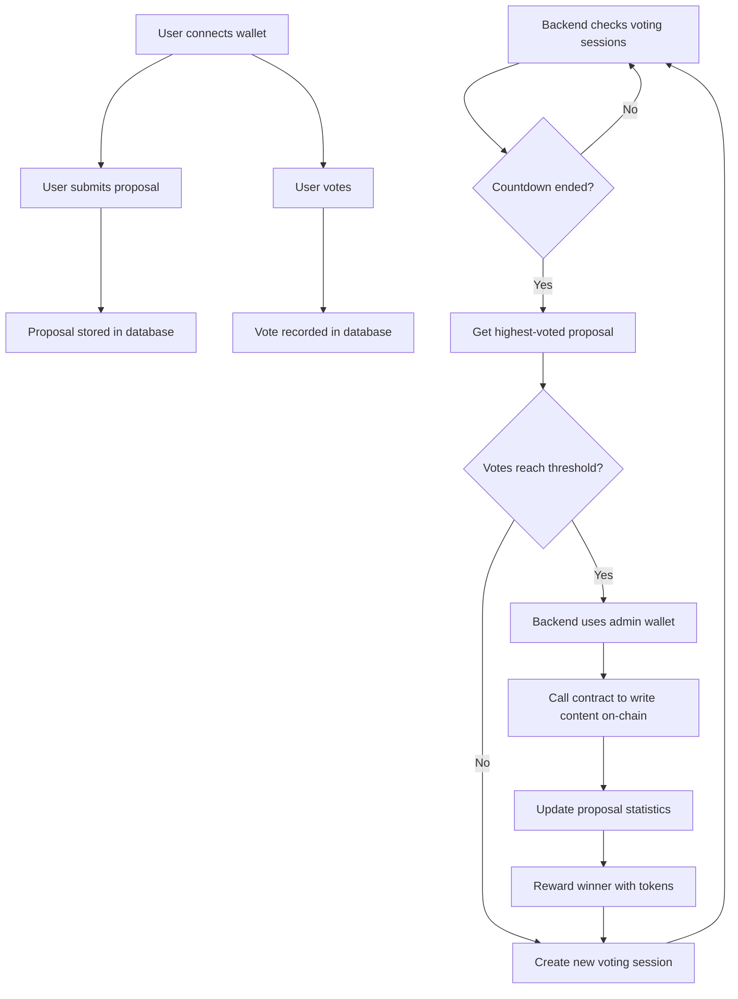
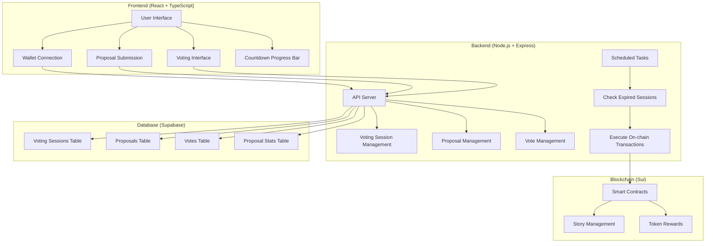

# NarrFlow - Collaborative Storytelling Platform

NarrFlow is a decentralized collaborative fiction writing platform based on blockchain technology, allowing users to co-create stories and earn token rewards. The platform supports story creation, paragraph addition, and voting decisions, combining creative freedom with community consensus mechanisms.

**[中文文档](README_zh.md)**

## Latest Architecture Overview
- Adopts a separated frontend and backend architecture, with Node.js + Express + TypeScript for the backend
- All voting behaviors and vote counting are processed through the backend server, with data stored in Supabase database
- Backend regularly checks voting sessions and automatically writes the highest-voted proposal to the blockchain when countdown ends
- Only final winning content (titles, paragraphs) is stored on-chain, not voting details
- Proposal creators and winners receive token rewards

## Features
- **Collaborative Creation**: Multiple participants contribute to story creation, collectively deciding plot development
- **Voting Mechanism**: Community votes for the best paragraph proposals, ensuring high-quality content
- **Token Rewards**: Creators and participants can earn token rewards
- **On-chain Governance**: Transparent voting and decision-making, permanently recorded on the blockchain
- **Countdown Voting**: Visual progress bar countdown voting mechanism
- **Mobile Friendly**: Responsive design supporting multi-device access
- **Multi-language Support**: Built-in English and Chinese interface switching

## Tech Stack
### Frontend Technologies
- React 18 + TypeScript
- TailwindCSS
- Vite
- @mysten/slush-wallet (wallet connection)

### Backend Technologies
- Node.js + Express
- TypeScript
- @mysten/sui SDK
- Supabase (database)
- node-cron (scheduled tasks)

### Blockchain Technologies
- Smart Contracts: Move on Sui
- Network: Sui Testnet/Mainnet

## Smart Contract Modules
- **story.move** - Story and paragraph management
- **treasury.move** - Token and reward system

## Storage Strategy
- On-chain storage: Book titles, paragraph content, author addresses
- Database storage: Voting sessions, proposals, voting records, proposal statistics

## Project Logic Flow


## Deployment Guide

### Prerequisites
- Node.js 18+ and pnpm
- Sui CLI tools
- Supabase account
- Admin wallet (for executing on-chain transactions)

### Step 1: Deploy Smart Contracts
```bash
# Switch to contract directory
cd move

# Compile contracts
sui move build

# Deploy contracts to testnet or mainnet
sui client publish --gas-budget 100000000
```

After deployment, record the following information:
- Package ID
- StoryBook ID
- Treasury ID

### Step 2: Set Up Supabase Database
1. Create a Supabase project
2. Execute the following SQL statements to create necessary tables:

```sql
-- Enable UUID extension
CREATE EXTENSION IF NOT EXISTS "uuid-ossp";

-- Create voting sessions table
CREATE TABLE IF NOT EXISTS public.voting_sessions (
  id UUID PRIMARY KEY DEFAULT uuid_generate_v4(),
  type TEXT NOT NULL CHECK (type IN ('title', 'paragraph')),
  status TEXT NOT NULL CHECK (status IN ('active', 'completed', 'failed')),
  expires_at TIMESTAMP WITH TIME ZONE NOT NULL,
  notes TEXT,
  created_at TIMESTAMP WITH TIME ZONE NOT NULL DEFAULT NOW(),
  updated_at TIMESTAMP WITH TIME ZONE NOT NULL DEFAULT NOW()
);

-- Create proposals table
CREATE TABLE IF NOT EXISTS public.proposals (
  id UUID PRIMARY KEY DEFAULT uuid_generate_v4(),
  content TEXT NOT NULL,
  author TEXT NOT NULL,
  type TEXT NOT NULL CHECK (type IN ('title', 'paragraph')),
  votes INTEGER NOT NULL DEFAULT 0,
  created_at TIMESTAMP WITH TIME ZONE NOT NULL DEFAULT NOW()
);

-- Create votes table
CREATE TABLE IF NOT EXISTS public.votes (
  id UUID PRIMARY KEY DEFAULT uuid_generate_v4(),
  proposal_id UUID NOT NULL REFERENCES public.proposals(id) ON DELETE CASCADE,
  voter TEXT NOT NULL,
  created_at TIMESTAMP WITH TIME ZONE NOT NULL DEFAULT NOW(),
  UNIQUE(voter)
);

-- Create proposal stats table
CREATE TABLE IF NOT EXISTS public.proposal_stats (
  id UUID PRIMARY KEY DEFAULT uuid_generate_v4(),
  author TEXT NOT NULL UNIQUE,
  proposals_submitted INTEGER NOT NULL DEFAULT 0,
  proposals_won INTEGER NOT NULL DEFAULT 0,
  votes_received INTEGER NOT NULL DEFAULT 0,
  tokens_earned INTEGER NOT NULL DEFAULT 0,
  created_at TIMESTAMP WITH TIME ZONE NOT NULL DEFAULT NOW(),
  updated_at TIMESTAMP WITH TIME ZONE NOT NULL DEFAULT NOW()
);

-- Create indexes
CREATE INDEX IF NOT EXISTS idx_proposals_type ON public.proposals(type);
CREATE INDEX IF NOT EXISTS idx_proposals_author ON public.proposals(author);
CREATE INDEX IF NOT EXISTS idx_votes_proposal_id ON public.votes(proposal_id);
CREATE INDEX IF NOT EXISTS idx_votes_voter ON public.votes(voter);
CREATE INDEX IF NOT EXISTS idx_proposal_stats_author ON public.proposal_stats(author);
CREATE INDEX IF NOT EXISTS idx_voting_sessions_status ON public.voting_sessions(status);
CREATE INDEX IF NOT EXISTS idx_voting_sessions_expires_at ON public.voting_sessions(expires_at);

-- Create an active voting session
INSERT INTO public.voting_sessions (type, status, expires_at, created_at, updated_at)
VALUES ('title', 'active', NOW() + INTERVAL '5 minutes', NOW(), NOW());
```

3. Record Supabase URL and API Key

4. Set up RLS (Row Level Security) policies in Supabase to ensure data security:

```sql
-- Enable RLS for all tables
ALTER TABLE public.voting_sessions ENABLE ROW LEVEL SECURITY;
ALTER TABLE public.proposals ENABLE ROW LEVEL SECURITY;
ALTER TABLE public.votes ENABLE ROW LEVEL SECURITY;
ALTER TABLE public.proposal_stats ENABLE ROW LEVEL SECURITY;

-- Create policies for anonymous reading
CREATE POLICY "Allow anonymous reading of voting sessions" ON public.voting_sessions FOR SELECT USING (true);
CREATE POLICY "Allow anonymous reading of proposals" ON public.proposals FOR SELECT USING (true);
CREATE POLICY "Allow anonymous reading of votes" ON public.votes FOR SELECT USING (true);
CREATE POLICY "Allow anonymous reading of proposal stats" ON public.proposal_stats FOR SELECT USING (true);

-- Create policies for service role full access
CREATE POLICY "Allow service role full access to voting sessions" ON public.voting_sessions USING (auth.role() = 'service_role');
CREATE POLICY "Allow service role full access to proposals" ON public.proposals USING (auth.role() = 'service_role');
CREATE POLICY "Allow service role full access to votes" ON public.votes USING (auth.role() = 'service_role');
CREATE POLICY "Allow service role full access to proposal stats" ON public.proposal_stats USING (auth.role() = 'service_role');
```

### Step 3: Configure Environment Variables
Create a `.env` file in the project root directory:

```bash
# Blockchain configuration
VITE_PACKAGE_ID=your_package_id
VITE_STORYBOOK_ID=your_storybook_object_id
VITE_TREASURY_ID=your_treasury_object_id
VITE_SUI_NETWORK=testnet  # or mainnet

# Database configuration
VITE_SUPABASE_URL=your_supabase_url
VITE_SUPABASE_KEY=your_supabase_api_key
SUPABASE_URL=your_supabase_url  # for backend
SUPABASE_KEY=your_supabase_service_role_key  # for backend, note this needs to be the service role key

# Backend configuration
PORT=3001
VOTING_COUNTDOWN_SECONDS=300  # voting countdown in seconds
VOTE_THRESHOLD=10  # voting threshold, at least 10 votes needed to win

# Admin wallet private key (for executing on-chain transactions)
ADMIN_PRIVATE_KEY=your_admin_wallet_private_key  # Bech32 format private key
```

> **Important Note**: Ensure the `.env` file is not committed to version control. Add `.env` to your `.gitignore` file to prevent accidental commits.

### Step 4: Install Dependencies and Build the Project
```bash
# Clone repository
git clone https://github.com/YourUsername/NarrFlow-Web3.git
cd NarrFlow-Web3

# Install dependencies
pnpm install

# Build backend
cd server
pnpm build

# Return to root directory
cd ..

# Build frontend
pnpm build
```

### Step 5: Start Services
#### Development Environment:
```bash
# Start backend server
cd server
node dist/index.js
# Or use nodemon for development
# npx nodemon dist/index.js

# Open a new terminal, start frontend development server
cd ..
pnpm dev
```

#### Production Environment:
```bash
# Build production version
pnpm build

# Start backend server (using PM2 for process management)
cd server
npm install -g pm2
pm2 start dist/index.js --name "narrflow-backend"

# Deploy frontend
# Method 1: Using Nginx
sudo apt-get install nginx
sudo cp -r ../dist/* /var/www/html/
sudo systemctl restart nginx

# Method 2: Using serve (for simple testing)
npm install -g serve
serve -s ../dist -l 5000
```

## System Architecture Diagram


## Contribution
Contributions of code, issue reports, or improvement suggestions are welcome. Please fork this repository, create a feature branch, and then submit a PR.

## License
This project is licensed under the [MIT License](LICENSE).
