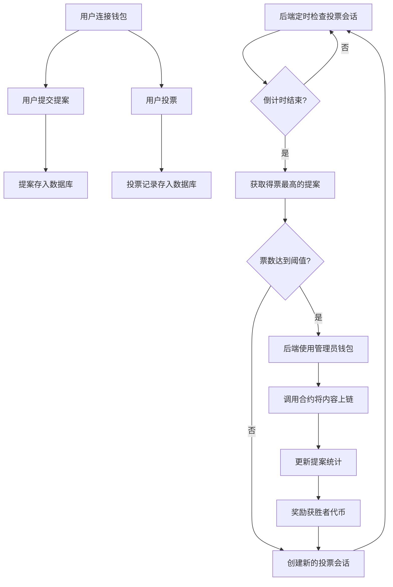
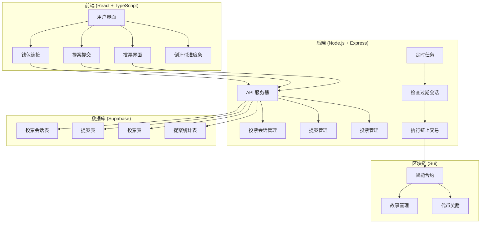

# NarrFlow - 协作叙事平台

NarrFlow 是一个基于区块链技术的去中心化协作小说创作平台，允许用户共同创作故事并获得代币奖励。平台支持故事创建、段落添加、投票决策，结合了创作自由与社区共识机制。

## 最新架构说明
- 采用前后端分离架构，后端使用 Node.js + Express + TypeScript
- 所有投票行为和票数统计通过后端服务器处理，数据存储在 Supabase 数据库中
- 后端定时检查投票会话，当倒计时结束时，自动将得票最高的提案通过合约写入链上
- 链上只存储最终胜出的内容（标题、段落），不存储投票细节
- 提案创建者和获胜者可获得代币奖励

## 功能特性
- **协作创作**：多人参与故事创作，共同决定情节发展
- **投票机制**：社区投票选出最佳段落提案，确保高质量内容
- **代币奖励**：创作者和参与者可获得代币奖励
- **链上治理**：投票和决策透明，永久记录在区块链上
- **倒计时投票**：带有可视化进度条的倒计时投票机制
- **移动友好**：响应式设计，支持多端访问
- **多语言支持**：内置中英文界面切换

## 技术栈
### 前端技术
- React 18 + TypeScript
- TailwindCSS
- Vite
- @mysten/slush-wallet (钱包连接)

### 后端技术
- Node.js + Express
- TypeScript
- @mysten/sui SDK
- Supabase (数据库)
- node-cron (定时任务)

### 区块链技术
- 智能合约：Move on Sui
- 网络：Sui Testnet/Mainnet

## 智能合约模块
- **story.move** - 故事与段落管理
- **treasury.move** - 代币和奖励系统

## 存储策略
- 链上存储：书籍标题、段落内容、作者地址
- 数据库存储：投票会话、提案、投票记录、提案统计

## 项目逻辑流程图


## 部署指南

### 前置条件
- Node.js 18+ 和 pnpm
- Sui CLI 工具
- Supabase 账户
- 管理员钱包（用于执行链上交易）

### 步骤 1: 部署智能合约
```bash
# 切换到合约目录
cd move

# 编译合约
sui move build

# 部署合约到测试网或主网
sui client publish --gas-budget 100000000
```

部署后记录以下信息：
- Package ID
- StoryBook ID
- Treasury ID

### 步骤 2: 设置 Supabase 数据库
1. 创建 Supabase 项目
2. 执行以下 SQL 语句创建必要的表：

```sql
-- 启用 UUID 扩展
CREATE EXTENSION IF NOT EXISTS "uuid-ossp";

-- 创建投票会话表
CREATE TABLE IF NOT EXISTS public.voting_sessions (
  id UUID PRIMARY KEY DEFAULT uuid_generate_v4(),
  type TEXT NOT NULL CHECK (type IN ('title', 'paragraph')),
  status TEXT NOT NULL CHECK (status IN ('active', 'completed', 'failed')),
  expires_at TIMESTAMP WITH TIME ZONE NOT NULL,
  notes TEXT,
  created_at TIMESTAMP WITH TIME ZONE NOT NULL DEFAULT NOW(),
  updated_at TIMESTAMP WITH TIME ZONE NOT NULL DEFAULT NOW()
);

-- 创建提案表
CREATE TABLE IF NOT EXISTS public.proposals (
  id UUID PRIMARY KEY DEFAULT uuid_generate_v4(),
  content TEXT NOT NULL,
  author TEXT NOT NULL,
  type TEXT NOT NULL CHECK (type IN ('title', 'paragraph')),
  votes INTEGER NOT NULL DEFAULT 0,
  created_at TIMESTAMP WITH TIME ZONE NOT NULL DEFAULT NOW()
);

-- 创建投票表
CREATE TABLE IF NOT EXISTS public.votes (
  id UUID PRIMARY KEY DEFAULT uuid_generate_v4(),
  proposal_id UUID NOT NULL REFERENCES public.proposals(id) ON DELETE CASCADE,
  voter TEXT NOT NULL,
  created_at TIMESTAMP WITH TIME ZONE NOT NULL DEFAULT NOW(),
  UNIQUE(voter)
);

-- 创建提案统计表
CREATE TABLE IF NOT EXISTS public.proposal_stats (
  id UUID PRIMARY KEY DEFAULT uuid_generate_v4(),
  author TEXT NOT NULL UNIQUE,
  proposals_submitted INTEGER NOT NULL DEFAULT 0,
  proposals_won INTEGER NOT NULL DEFAULT 0,
  votes_received INTEGER NOT NULL DEFAULT 0,
  tokens_earned INTEGER NOT NULL DEFAULT 0,
  created_at TIMESTAMP WITH TIME ZONE NOT NULL DEFAULT NOW(),
  updated_at TIMESTAMP WITH TIME ZONE NOT NULL DEFAULT NOW()
);

-- 创建索引
CREATE INDEX IF NOT EXISTS idx_proposals_type ON public.proposals(type);
CREATE INDEX IF NOT EXISTS idx_proposals_author ON public.proposals(author);
CREATE INDEX IF NOT EXISTS idx_votes_proposal_id ON public.votes(proposal_id);
CREATE INDEX IF NOT EXISTS idx_votes_voter ON public.votes(voter);
CREATE INDEX IF NOT EXISTS idx_proposal_stats_author ON public.proposal_stats(author);
CREATE INDEX IF NOT EXISTS idx_voting_sessions_status ON public.voting_sessions(status);
CREATE INDEX IF NOT EXISTS idx_voting_sessions_expires_at ON public.voting_sessions(expires_at);

-- 创建一个活跃的投票会话
INSERT INTO public.voting_sessions (type, status, expires_at, created_at, updated_at)
VALUES ('title', 'active', NOW() + INTERVAL '5 minutes', NOW(), NOW());
```

3. 记录 Supabase URL 和 API Key

4. 在 Supabase 中设置 RLS (Row Level Security) 策略，确保数据安全：

```sql
-- 为所有表启用 RLS
ALTER TABLE public.voting_sessions ENABLE ROW LEVEL SECURITY;
ALTER TABLE public.proposals ENABLE ROW LEVEL SECURITY;
ALTER TABLE public.votes ENABLE ROW LEVEL SECURITY;
ALTER TABLE public.proposal_stats ENABLE ROW LEVEL SECURITY;

-- 创建允许匿名读取的策略
CREATE POLICY "允许匿名读取投票会话" ON public.voting_sessions FOR SELECT USING (true);
CREATE POLICY "允许匿名读取提案" ON public.proposals FOR SELECT USING (true);
CREATE POLICY "允许匿名读取投票" ON public.votes FOR SELECT USING (true);
CREATE POLICY "允许匿名读取提案统计" ON public.proposal_stats FOR SELECT USING (true);

-- 创建允许服务角色完全访问的策略
CREATE POLICY "允许服务角色完全访问投票会话" ON public.voting_sessions USING (auth.role() = 'service_role');
CREATE POLICY "允许服务角色完全访问提案" ON public.proposals USING (auth.role() = 'service_role');
CREATE POLICY "允许服务角色完全访问投票" ON public.votes USING (auth.role() = 'service_role');
CREATE POLICY "允许服务角色完全访问提案统计" ON public.proposal_stats USING (auth.role() = 'service_role');
```

### 步骤 3: 配置环境变量
在项目根目录创建 `.env` 文件：

```bash
# 区块链配置
VITE_PACKAGE_ID=你的包ID
VITE_STORYBOOK_ID=你的StoryBook对象ID
VITE_TREASURY_ID=你的Treasury对象ID
VITE_SUI_NETWORK=testnet  # 或 mainnet

# 数据库配置
VITE_SUPABASE_URL=你的Supabase URL
VITE_SUPABASE_KEY=你的Supabase API Key
SUPABASE_URL=你的Supabase URL  # 后端使用
SUPABASE_KEY=你的Supabase服务角色Key  # 后端使用，注意这里需要使用服务角色Key

# 后端配置
PORT=3001
VOTING_COUNTDOWN_SECONDS=300  # 投票倒计时（秒）
VOTE_THRESHOLD=10  # 投票阈值，至少需要10票才能胜出

# 管理员钱包私钥（用于执行链上交易）
ADMIN_PRIVATE_KEY=你的管理员钱包私钥  # Bech32格式的私钥
```

> **重要提示**：确保 `.env` 文件不会被提交到版本控制系统中。在 `.gitignore` 文件中添加 `.env` 以防止意外提交。

### 步骤 4: 安装依赖并构建项目
```bash
# 克隆仓库
git clone https://github.com/YourUsername/NarrFlow-Web3.git
cd NarrFlow-Web3

# 安装依赖
pnpm install

# 构建后端
cd server
pnpm build

# 返回根目录
cd ..

# 构建前端
pnpm build
```

### 步骤 5: 启动服务
#### 开发环境：
```bash
# 启动后端服务器
cd server
node dist/index.js
# 或者使用 nodemon 进行开发
# npx nodemon dist/index.js

# 新开一个终端，启动前端开发服务器
cd ..
pnpm dev
```

#### 生产环境：
```bash
# 构建生产版本
pnpm build

# 启动后端服务器（使用 PM2 进行进程管理）
cd server
npm install -g pm2
pm2 start dist/index.js --name "narrflow-backend"

# 部署前端
# 方法1：使用 Nginx 部署
sudo apt-get install nginx
sudo cp -r ../dist/* /var/www/html/
sudo systemctl restart nginx

# 方法2：使用 serve 部署（简单测试用）
npm install -g serve
serve -s ../dist -l 5000
```

### 步骤 6: 生产环境优化
1. **设置 HTTPS**：
```bash
# 使用 Let's Encrypt 获取 SSL 证书
sudo apt-get install certbot python3-certbot-nginx
sudo certbot --nginx -d yourdomain.com
```

2. **Nginx 配置优化**：
创建 `/etc/nginx/sites-available/narrflow.conf`：
```nginx
server {
    listen 80;
    server_name yourdomain.com;
    return 301 https://$host$request_uri;
}

server {
    listen 443 ssl;
    server_name yourdomain.com;

    ssl_certificate /etc/letsencrypt/live/yourdomain.com/fullchain.pem;
    ssl_certificate_key /etc/letsencrypt/live/yourdomain.com/privkey.pem;

    # 前端静态文件
    location / {
        root /var/www/html;
        try_files $uri $uri/ /index.html;
        expires 1d;
        add_header Cache-Control "public, max-age=86400";
    }

    # 后端 API 代理
    location /api {
        proxy_pass http://localhost:3001;
        proxy_http_version 1.1;
        proxy_set_header Upgrade $http_upgrade;
        proxy_set_header Connection 'upgrade';
        proxy_set_header Host $host;
        proxy_cache_bypass $http_upgrade;
    }
}
```

3. **启用链接**：
```bash
sudo ln -s /etc/nginx/sites-available/narrflow.conf /etc/nginx/sites-enabled/
sudo nginx -t
sudo systemctl restart nginx
```

4. **设置自动更新**：
```bash
# 创建更新脚本
cat > update.sh << 'EOF'
#!/bin/bash
cd /path/to/NarrFlow-Web3
git pull
pnpm install
pnpm build
cd server
pnpm build
pm2 restart narrflow-backend
sudo cp -r ../dist/* /var/www/html/
EOF

chmod +x update.sh

# 添加到 crontab（每天凌晨3点更新）
(crontab -l 2>/dev/null; echo "0 3 * * * /path/to/update.sh") | crontab -
```

## 系统架构图


## 监控与维护
### 日常维护
1. **检查服务器日志**：定期检查后端服务器日志，确保没有错误或异常
2. **监控数据库**：检查数据库连接和表大小，必要时进行优化
3. **更新依赖**：定期更新 npm 依赖，特别是安全相关的更新

### 故障排除
1. **投票未自动执行**：
   - 检查后端服务器是否正常运行：`pm2 status` 或 `ps aux | grep node`
   - 检查定时任务是否正常执行：查看日志 `pm2 logs narrflow-backend`
   - 检查管理员钱包是否有足够的 gas：使用 Sui Explorer 查看钱包余额
   - 查看服务器日志中的错误信息：`pm2 logs narrflow-backend --lines 100`
   - 确认环境变量是否正确设置：检查 `.env` 文件中的 `ADMIN_PRIVATE_KEY`

2. **前端无法连接后端**：
   - 确认后端服务器正在运行：`curl http://localhost:3001/api/health`
   - 检查 CORS 设置：确保后端允许前端域名的请求
   - 验证 API 端点是否正确：检查前端代码中的 API URL
   - 检查网络防火墙：确保端口 3001 已开放

3. **数据库连接问题**：
   - 检查 Supabase 凭证是否正确：验证 `.env` 文件中的 URL 和 Key
   - 确认 Supabase 服务是否可用：访问 Supabase 控制台
   - 检查网络连接：`ping database.supabase.co`
   - 检查 RLS 策略：确保在 Supabase 中正确设置了行级安全策略

4. **区块链交互问题**：
   - 检查合约 ID 是否正确：验证 `.env` 文件中的 `PACKAGE_ID`、`STORYBOOK_ID` 等
   - 确认网络设置：检查是否连接到正确的网络（testnet/mainnet）
   - 检查交易历史：使用 Sui Explorer 查看最近的交易
   - 验证智能合约：确保合约已正确部署并初始化

5. **前端显示问题**：
   - 清除浏览器缓存：按 Ctrl+F5 或使用开发者工具清除缓存
   - 检查控制台错误：打开浏览器开发者工具查看错误信息
   - 验证 API 响应：使用开发者工具的网络面板检查 API 响应
   - 检查 React 组件：确保组件正确渲染和更新

### 常见问题解答

1. **Q: 如何重置投票会话？**
   A: 在 Supabase 中执行以下 SQL：
   ```sql
   UPDATE public.voting_sessions SET status = 'completed' WHERE status = 'active';
   INSERT INTO public.voting_sessions (type, status, expires_at)
   VALUES ('title', 'active', NOW() + INTERVAL '5 minutes');
   ```

2. **Q: 如何修改投票倒计时时间？**
   A: 修改 `.env` 文件中的 `VOTING_COUNTDOWN_SECONDS` 值，然后重启后端服务器。

3. **Q: 如何查看当前活跃的投票会话？**
   A: 访问 `http://localhost:3001/api/voting-sessions/current` 或在 Supabase 中查询：
   ```sql
   SELECT * FROM public.voting_sessions WHERE status = 'active';
   ```

4. **Q: 如何手动触发投票结算？**
   A: 访问 `http://localhost:3001/api/voting-sessions/check`，这将触发后端检查过期的投票会话。

5. **Q: 如何清空所有提案和投票？**
   A: 在 Supabase 中执行以下 SQL（谨慎使用）：
   ```sql
   DELETE FROM public.votes;
   DELETE FROM public.proposals;
   ```

## 贡献
欢迎贡献代码、报告问题或提出改进建议。请先 fork 本仓库，创建功能分支，然后提交 PR。

## 许可证
本项目采用 [MIT 许可证](LICENSE)。
