# NarrFlow 项目演示

## 目录

1. 项目概述
2. 产品架构
3. 技术实现
4. 智能合约设计
5. Walrus存储策略
6. 代币经济
7. 用户流程
8. 未来发展

---

## 1. 项目概述

### NarrFlow：去中心化协作叙事平台

**核心理念**：让创作成为集体智慧的结晶

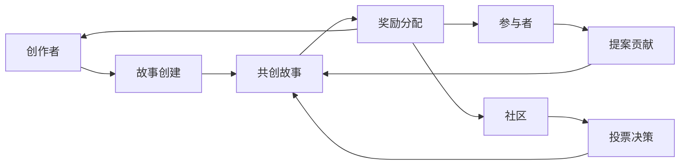

### 关键特性

- 📝 **协作创作**：多人参与，共同构建
- 🗳️ **社区投票**：决定故事走向
- 💰 **代币激励**：奖励贡献者
- 🔄 **透明公正**：区块链确保过程可信
- 🌍 **全球参与**：打破地域限制

---

## 2. 产品架构

### 系统架构

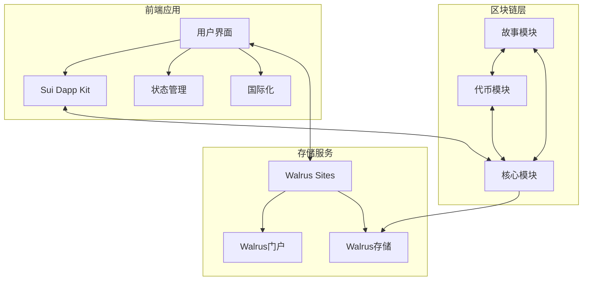

### 技术栈

**前端**
- React + TypeScript
- TailwindCSS
- Framer Motion

**区块链**
- Sui Move 智能合约
- Sui Wallet 集成

**存储**
- Walrus Sites (前端托管)
- Walrus 存储 (内容存储)
- Sui 链上存储 (状态和元数据)

---

## 3. 技术实现

### 前端实现

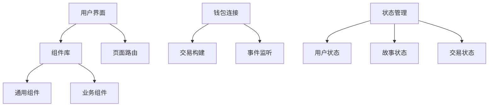

### 链上交互流程

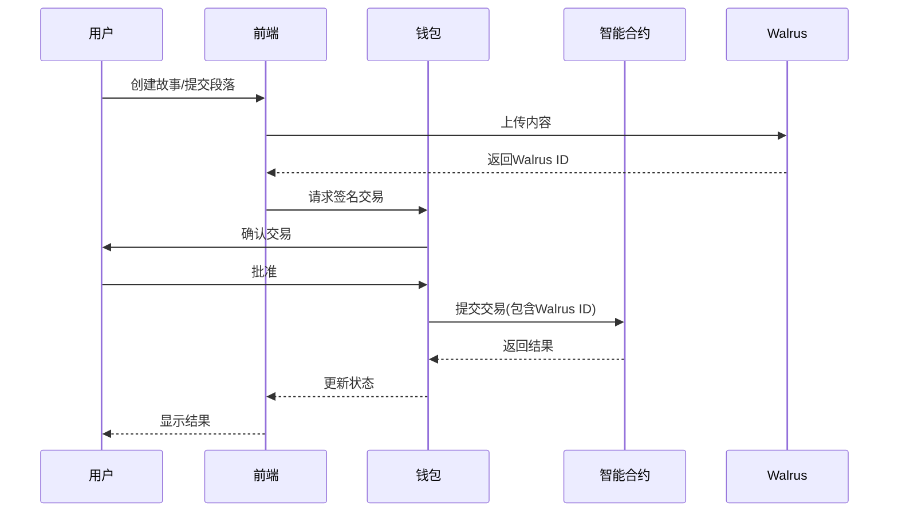

---

## 4. 智能合约设计

### 模块结构

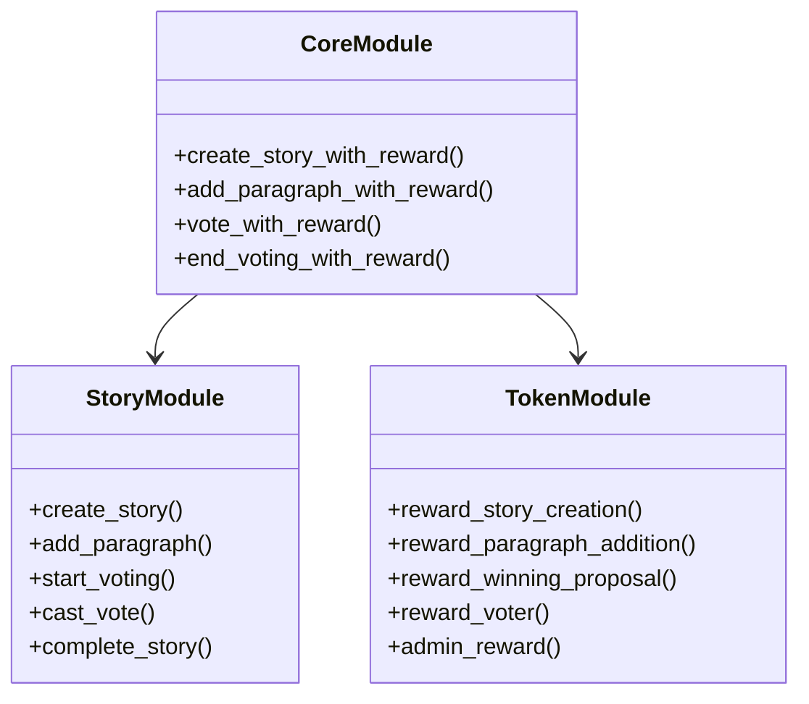

### 数据模型

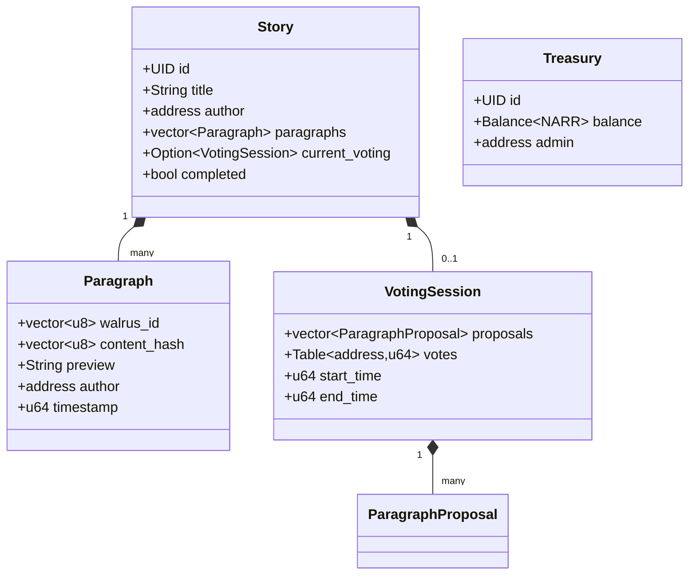

---

## 5. Walrus存储策略

### Walrus技术特点

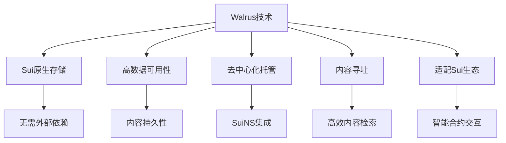

### Walrus Sites集成

**优势**:
- 前端托管在Walrus Sites上，无需管理服务器
- 通过site-builder工具简化部署流程
- 为每个故事生成专属URL: narrflow.wal.app/[故事ID]
- 利用SuiNS系统实现人性化命名
- 内容存储由多节点分布式保障

### 内容存储流程

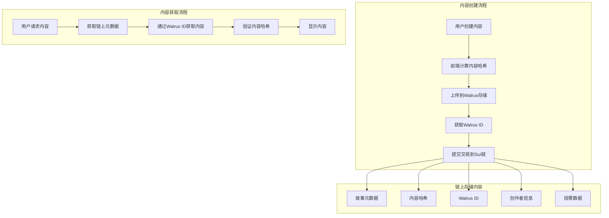

### 代码实现

```move
struct Paragraph has store {
    walrus_id: vector<u8>,    // Walrus上内容的唯一标识符
    content_hash: vector<u8>, // 内容哈希，用于验证
    preview: String,          // 短预览（约50字节）
    author: address,
    timestamp: u64
}

// 添加段落函数
public fun add_paragraph(
    story: &mut Story, 
    walrus_id: vector<u8>,
    content_hash: vector<u8>,
    preview: String,
    ctx: &mut TxContext
) {
    let paragraph = Paragraph {
        walrus_id,
        content_hash,
        preview,
        author: tx_context::sender(ctx),
        timestamp: tx_context::epoch(ctx)
    };
    vector::push_back(&mut story.paragraphs, paragraph);
}
```

### 为何选择Walrus

1. **原生集成**: 作为Sui生态的存储解决方案，与智能合约无缝对接
2. **高可用性**: 去中心化存储保证内容不会丢失
3. **前端托管**: Walrus Sites简化了项目部署流程
4. **用户体验**: 读取和显示内容速度更快，支持专属页面
5. **链生态**: 完全在Sui生态内运行，不依赖外部系统

---

## 6. 代币经济

### NARR代币奖励系统

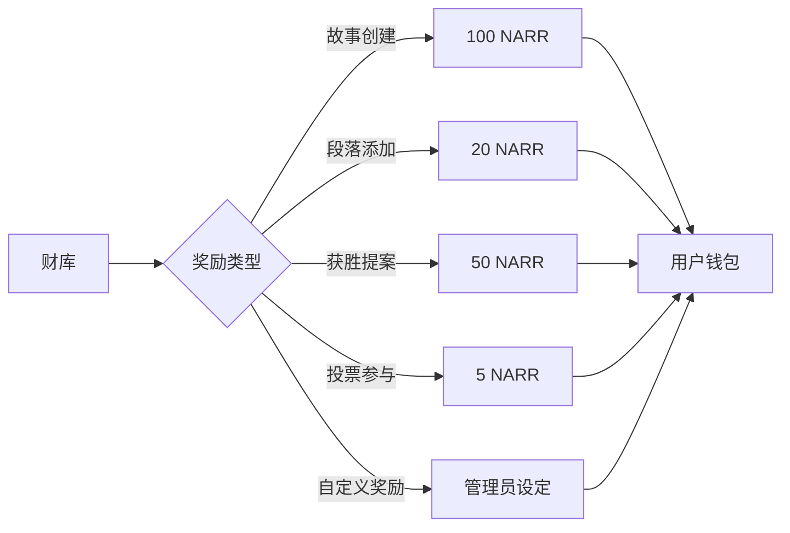

### 代币分配

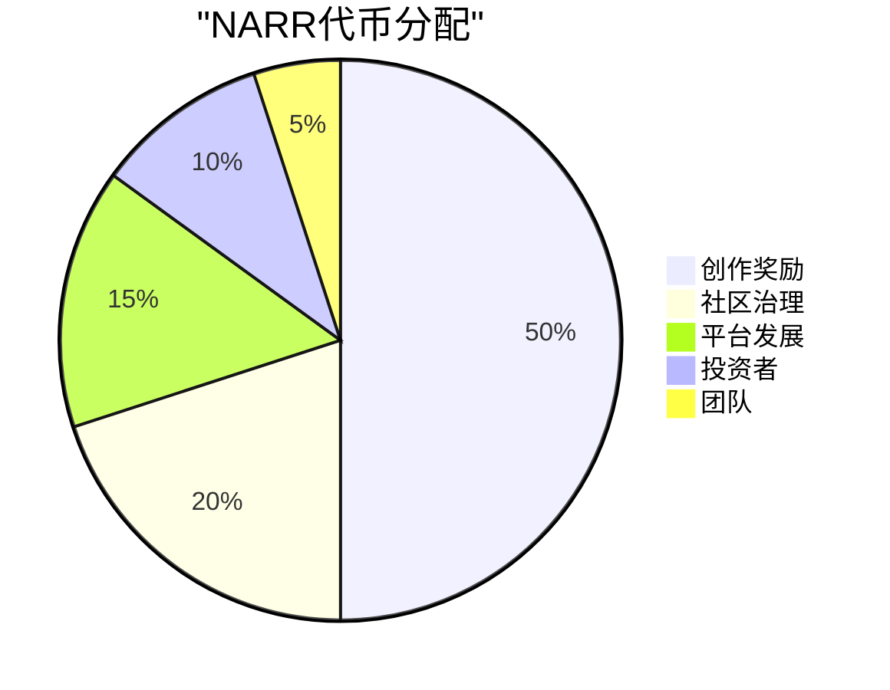

---

## 7. 用户流程

### 故事创建流程

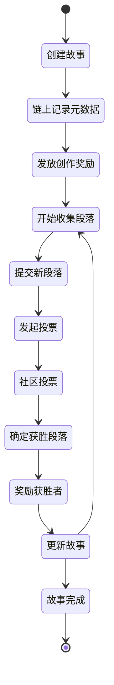

### 用户参与激励循环

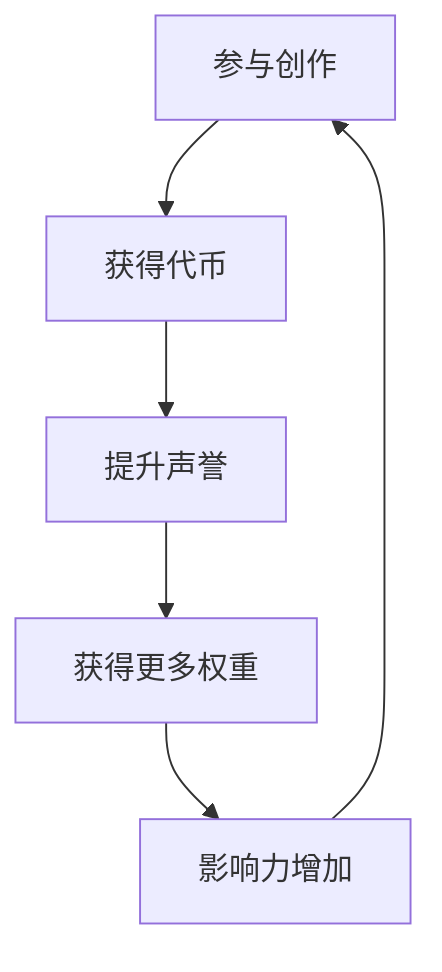

---

## 8. 未来发展

### 路线图

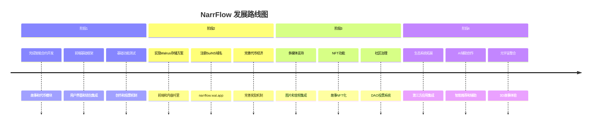

### 存储策略演进计划

**短期**：部署基础Walrus存储
- 前端部署到Walrus Sites
- 段落内容存储在Walrus

**中期**：强化Walrus集成
- 为每个故事创建专属Walrus Site页面
- 实现动态内容展示

**长期**：高级Walrus功能
- 开发自定义Walrus门户
- 建立NarrFlow专用存储协议

---

## 开发者看法与实现逻辑

### 技术选择理由

1. **为何选择Sui生态系统**：
   - Move语言的安全性和资源导向设计非常适合管理数字资产
   - Sui的高吞吐量和低交易费用适合频繁交互的叙事平台
   - 丰富的生态系统工具，如Walrus和SuiNS，提供完整解决方案

2. **为何选择Walrus而非其他存储**：
   - 原生Sui集成，无需跨链操作
   - Walrus Sites提供无服务器前端托管
   - 高数据可用性保证，解决内容持久性问题
   - 可以实现为每个故事/段落创建专属可访问页面

3. **模块化设计逻辑**：
   - 故事模块专注于叙事内容和投票逻辑
   - 代币模块管理激励系统
   - 核心模块整合功能，提供简化的用户体验

### 实现挑战与解决方案

1. **内容管理**：
   - 挑战：平衡链上存储成本与内容完整性
   - 解决方案：链上仅存储Walrus ID和内容哈希，实现高效验证

2. **投票机制**：
   - 挑战：确保投票公平性和激励参与
   - 解决方案：链上投票结合代币奖励，创建正反馈循环

3. **用户体验**：
   - 挑战：简化区块链交互复杂性
   - 解决方案：Walrus Sites提供类似传统Web应用的体验

### 部署建议

1. 首先部署故事和代币智能合约
2. 使用site-builder将前端部署到Walrus Sites
3. 注册SuiNS域名(narrflow.wal.app)
4. 实现段落内容上传到Walrus的功能
5. 开发专属故事页面的路由和渲染逻辑

### 系统安全考量

1. **内容验证**：
   - 使用哈希验证确保内容完整性
   - Walrus多节点存储保障数据安全

2. **权限控制**：
   - 故事作者拥有特定控制权限
   - 使用Sui的所有权模型管理资源

3. **审计**：
   - 所有操作产生链上事件便于追踪
   - 投票过程完全透明

---

总结：Walrus存储解决方案为NarrFlow提供了理想的技术基础，既保持了区块链的核心价值（去中心化、透明、不可篡改），又解决了内容存储的挑战。通过Walrus Sites，我们可以为用户提供无缝体验，同时确保内容的持久可访问性。 