# NarrFlow 项目演示

## 目录

1. 项目概述
2. 产品架构
3. 技术实现
4. 智能合约设计
5. 存储策略对比
6. 代币经济
7. 用户流程
8. 未来发展

---

## 1. 项目概述

### NarrFlow：去中心化协作叙事平台

**核心理念**：让创作成为集体智慧的结晶

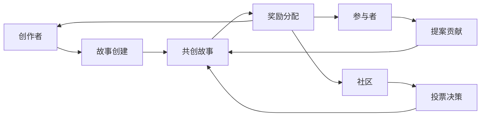

### 关键特性

- 📝 **协作创作**：多人参与，共同构建
- 🗳️ **社区投票**：决定故事走向
- 💰 **代币激励**：奖励贡献者
- 🔄 **透明公正**：区块链确保过程可信
- 🌍 **全球参与**：打破地域限制

---

## 2. 产品架构

### 系统架构

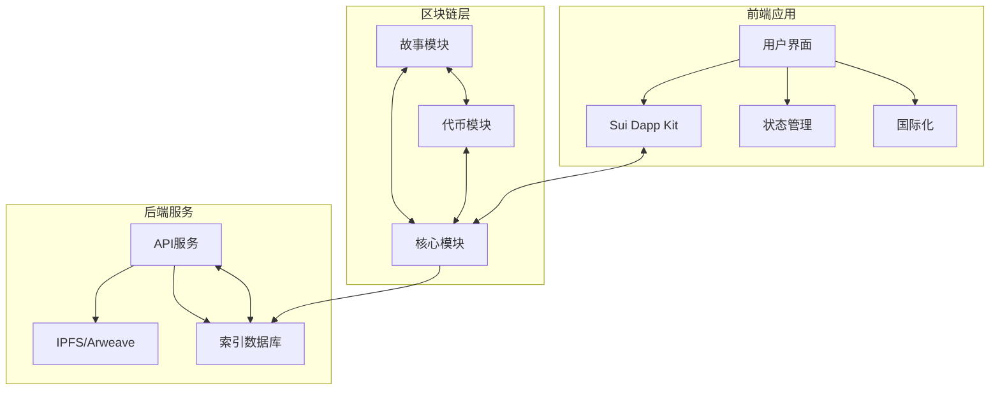

### 技术栈

**前端**
- React + TypeScript
- TailwindCSS
- Framer Motion

**区块链**
- Sui Move 智能合约
- Sui Wallet 集成

**存储**
- IPFS/Arweave (内容存储)
- Sui 链上存储 (状态和元数据)

---

## 3. 技术实现

### 前端实现

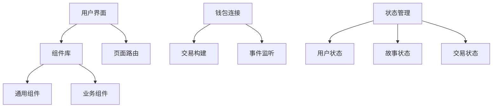

### 链上交互流程

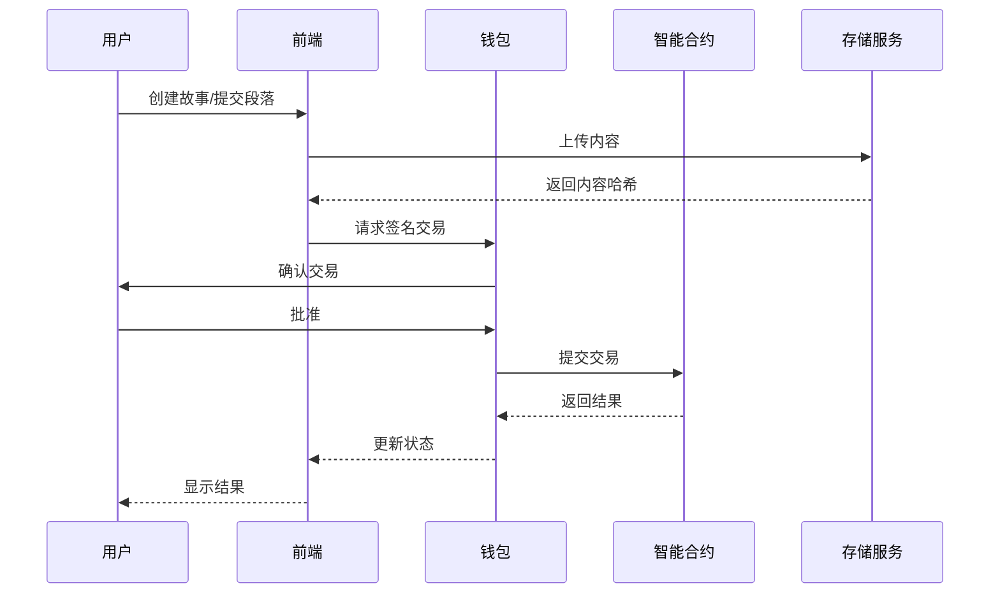

---

## 4. 智能合约设计

### 模块结构

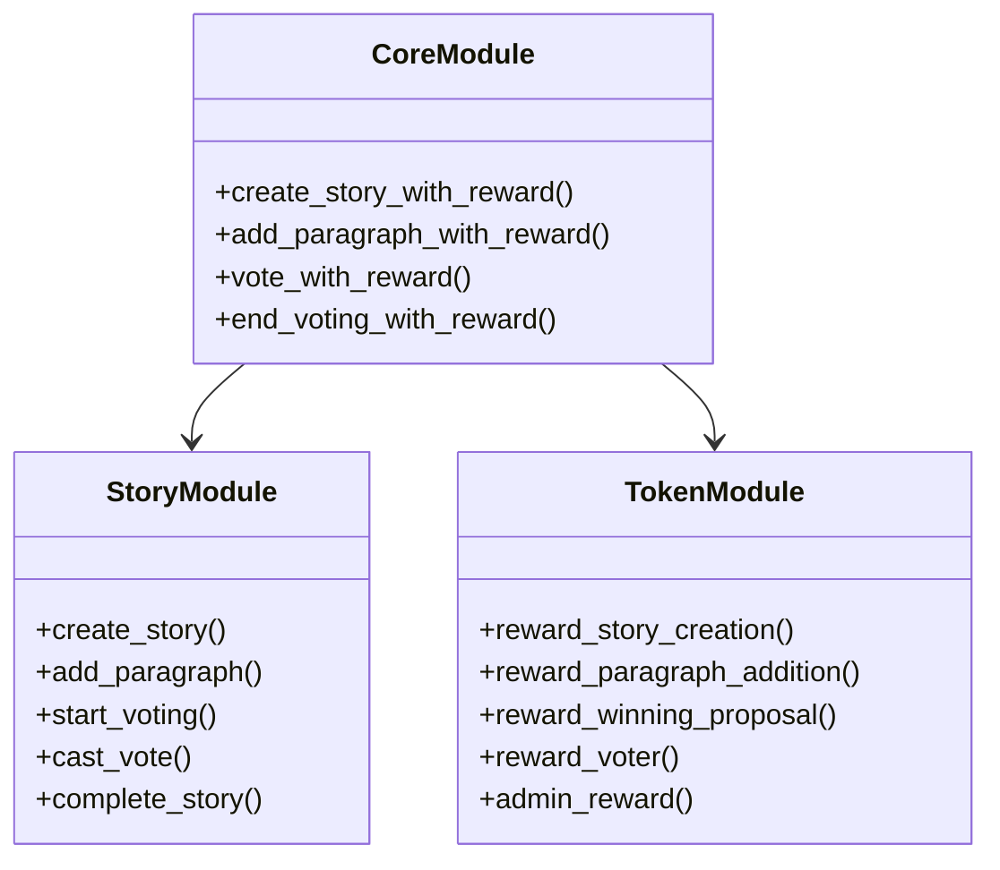

### 数据模型

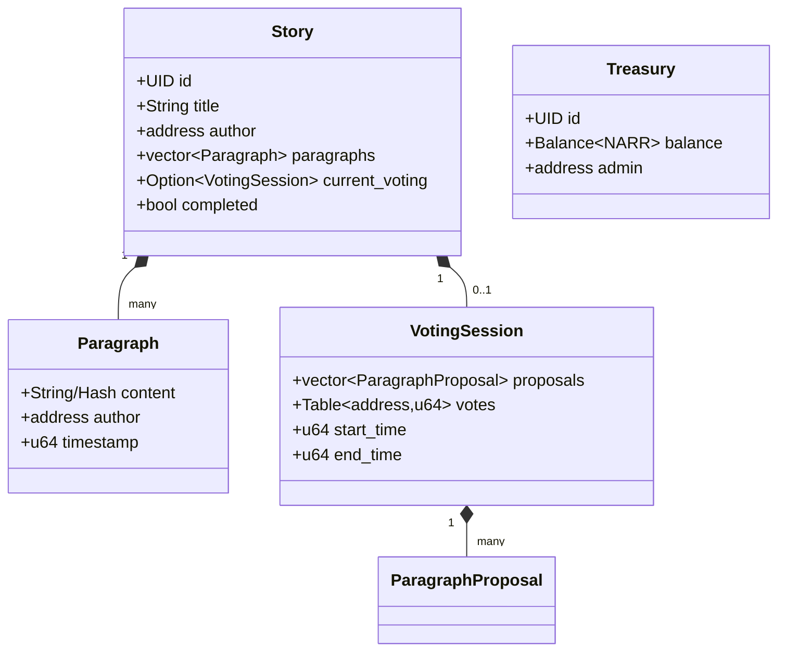

---

## 5. 存储策略对比

### 方案比较

| 特性 | 链上存储全文 | 链上存储哈希 |
|------|--------------|--------------|
| Gas成本 | 高 | 低 |
| 去中心化程度 | 完全去中心化 | 部分去中心化 |
| 内容大小限制 | 严格受限 | 几乎无限制 |
| 读取性能 | 较慢 | 较快 |
| 实现复杂度 | 简单 | 中等 |
| 多媒体支持 | 困难 | 容易 |
| 长期存储风险 | 低 | 中等 |

### 链上全文存储

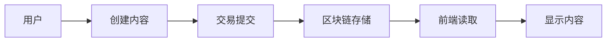

**优点**：
- 完全去中心化，无需外部依赖
- 内容永久存储在链上
- 简单直接的实现方式

**缺点**：
- 极高的Gas成本
- 内容长度严格受限
- 链上空间浪费
- 不适合多媒体内容

### 链上哈希存储

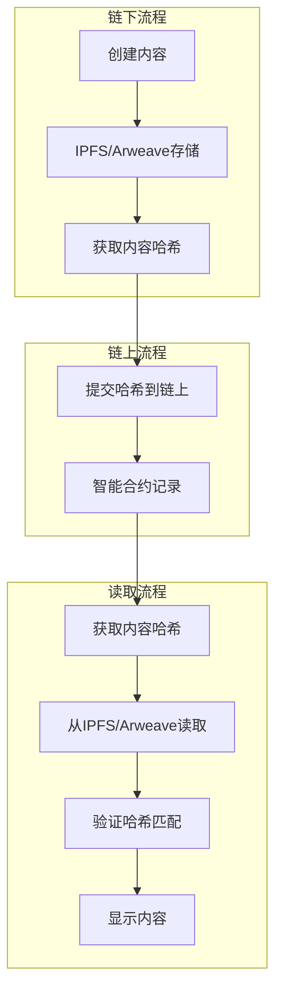

**优点**：
- 大幅降低Gas成本 (减少85-95%)
- 内容大小无限制
- 支持多媒体（图片、音频等）
- 更好的读取性能

**缺点**：
- 依赖外部存储系统
- 架构复杂度增加
- 需确保外部存储的持久性
- 完整内容验证需额外步骤

### 成本对比实例

假设一个标准段落为500字节：

**全文存储**：
- 每个段落约500字节
- 10个段落 = 5000字节
- Gas成本: ~0.05-0.1 SUI/段落

**哈希存储**：
- 每个哈希约32字节
- 10个段落 = 320字节
- Gas成本: ~0.003-0.008 SUI/段落

**成本节省**：约87-94%

---

## 6. 代币经济

### NARR代币奖励系统

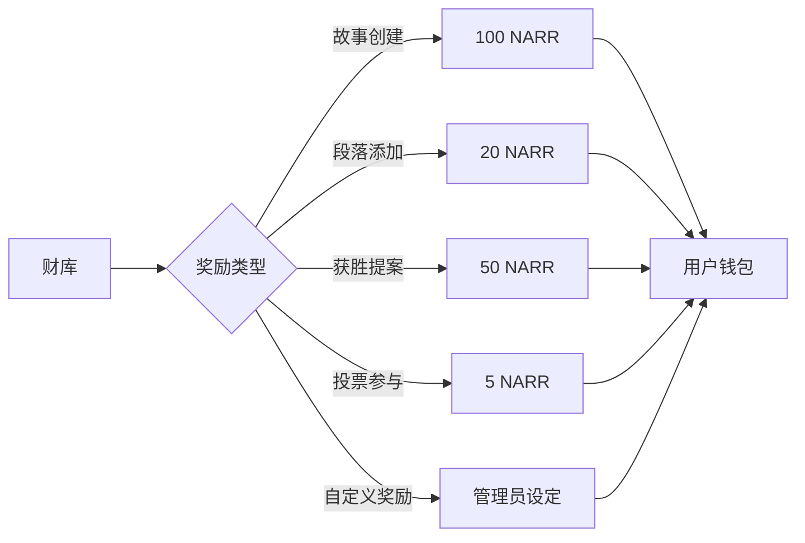

### 代币分配

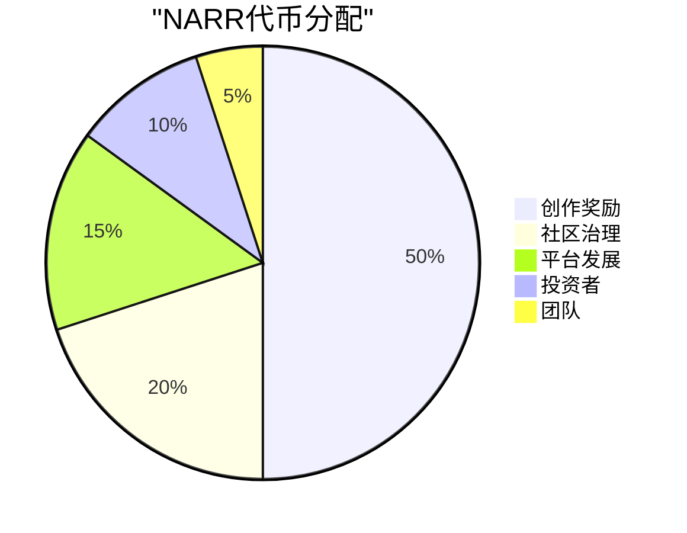

---

## 7. 用户流程

### 故事创建流程

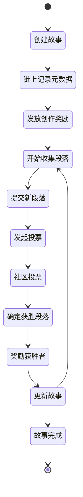

### 用户参与激励循环

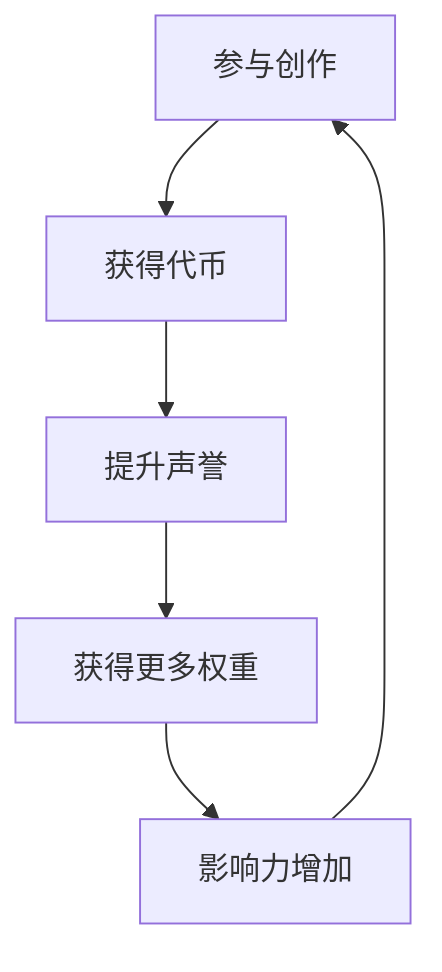

---

## 8. 未来发展

### 路线图

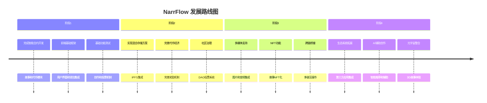

### 存储策略演进计划

**短期**：实施混合存储方案
- 内容存储在IPFS/Arweave
- 链上存储元数据和哈希

**中期**：优化存储机制
- 实现Sui原生对象感知存储
- 建立去中心化缓存层

**长期**：构建专用存储解决方案
- 开发NarrFlow专用存储协议
- 提供针对叙事内容的优化存储

---

## 对比分析：链上存储策略

### 详细技术对比

| 特性 | 全链上存储 | 混合存储（链上哈希） |
|------|------------|----------------------|
| **技术实现** | 直接使用Move字符串类型 | 结合IPFS/Arweave和链上哈希 |
| **数据大小** | 严格限制（通常<10KB） | 几乎无限制 | 
| **Gas成本** | 非常高，线性增长 | 大幅降低，仅存储哈希值 |
| **查询效率** | 适中（单一查询） | 更高（分布式内容检索） |
| **扩展性** | 有限，受链容量限制 | 高度可扩展 |
| **多媒体支持** | 几乎不可能 | 完全支持 |
| **实现复杂度** | 低 | 中 |
| **分叉风险** | 可能因数据大小触发分叉风险 | 极低分叉风险 |
| **外部依赖** | 无 | 依赖IPFS/Arweave |
| **去中心化程度** | 完全去中心化 | 依赖外部存储的去中心化程度 |

### 代码实现对比

**全链上存储实现**：

```move
struct Paragraph has store {
    content: String, // 直接存储全文
    author: address,
    timestamp: u64
}

// 添加段落函数
public fun add_paragraph(
    story: &mut Story, 
    content: String,
    ctx: &mut TxContext
) {
    let paragraph = Paragraph {
        content,  // 直接存储，占用大量链上空间
        author: tx_context::sender(ctx),
        timestamp: tx_context::epoch(ctx)
    };
    vector::push_back(&mut story.paragraphs, paragraph);
}
```

**混合存储实现**：

```move
struct Paragraph has store {
    content_hash: vector<u8>, // 仅存储内容哈希（32字节）
    content_uri: String,      // IPFS/Arweave URI
    content_preview: String,  // 短预览（约50字节）
    author: address,
    timestamp: u64
}

// 添加段落函数
public fun add_paragraph(
    story: &mut Story, 
    content_hash: vector<u8>,
    content_uri: String,
    content_preview: String,
    ctx: &mut TxContext
) {
    let paragraph = Paragraph {
        content_hash,  // 仅存储哈希，大幅节省空间
        content_uri,
        content_preview,
        author: tx_context::sender(ctx),
        timestamp: tx_context::epoch(ctx)
    };
    vector::push_back(&mut story.paragraphs, paragraph);
}
```

### 推荐：优化的混合存储模型

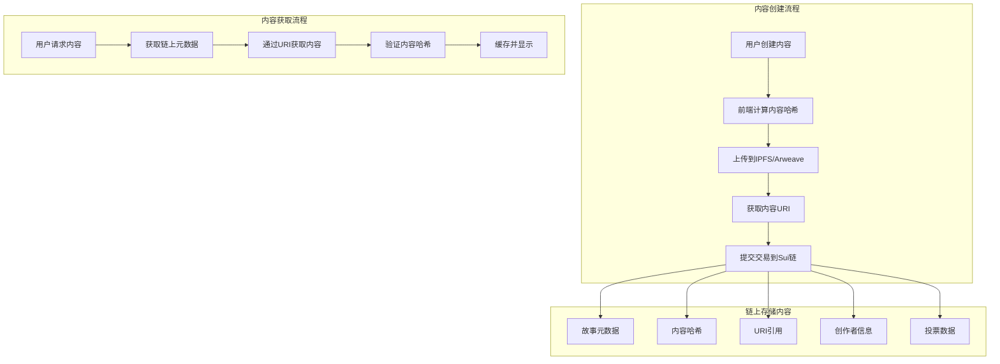

这种混合模型为NarrFlow项目提供了最佳的平衡：

1. **成本效益**：显著降低gas成本，使创作更加经济
2. **内容自由**：不受链上存储限制，支持丰富内容
3. **可验证性**：通过哈希保证内容完整性
4. **用户体验**：快速内容加载与显示
5. **技术可行性**：利用现有成熟技术实现

---

总结：混合存储模型代表了NarrFlow项目的最佳存储策略，既保持了区块链的核心价值（去中心化、透明、不可篡改），又解决了链上存储的局限性，为创作者提供更经济、更灵活的叙事平台。
