# NarrFlow 项目演示

## 目录

1. 项目概述
2. 产品架构
3. 技术实现
4. 智能合约设计
5. Walrus存储策略
6. 代币经济
7. 用户流程
8. 未来发展

---

## 1. 项目概述

### NarrFlow：去中心化协作叙事平台

**核心理念**：让创作成为集体智慧的结晶

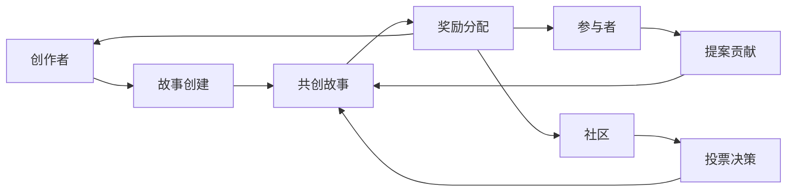

### 关键特性

- 📝 **协作创作**：多人参与，共同构建
- 🗳️ **社区投票**：决定故事走向
- 💰 **代币激励**：奖励贡献者
- 🔄 **透明公正**：区块链确保过程可信
- 🌍 **全球参与**：打破地域限制

---

## 2. 产品架构

### 系统架构

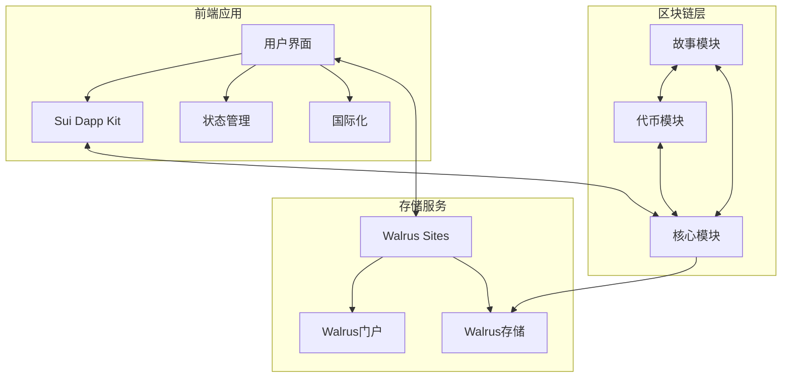

### 技术栈

**前端**
- React + TypeScript
- TailwindCSS
- Framer Motion

**区块链**
- Sui Move 智能合约
- Sui Wallet 集成

**存储**
- Walrus Sites (前端托管)
- Walrus 存储 (内容存储)
- Sui 链上存储 (状态和元数据)

---

## 3. 技术实现

### 前端实现

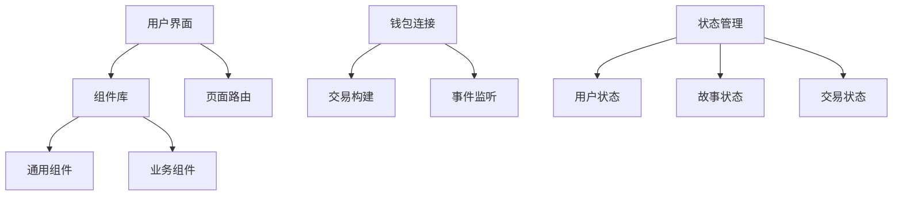

### 链上交互流程

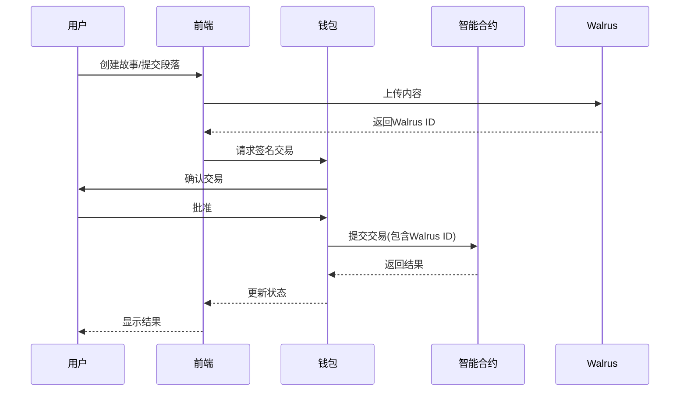

---

## 4. 智能合约设计

### 模块结构

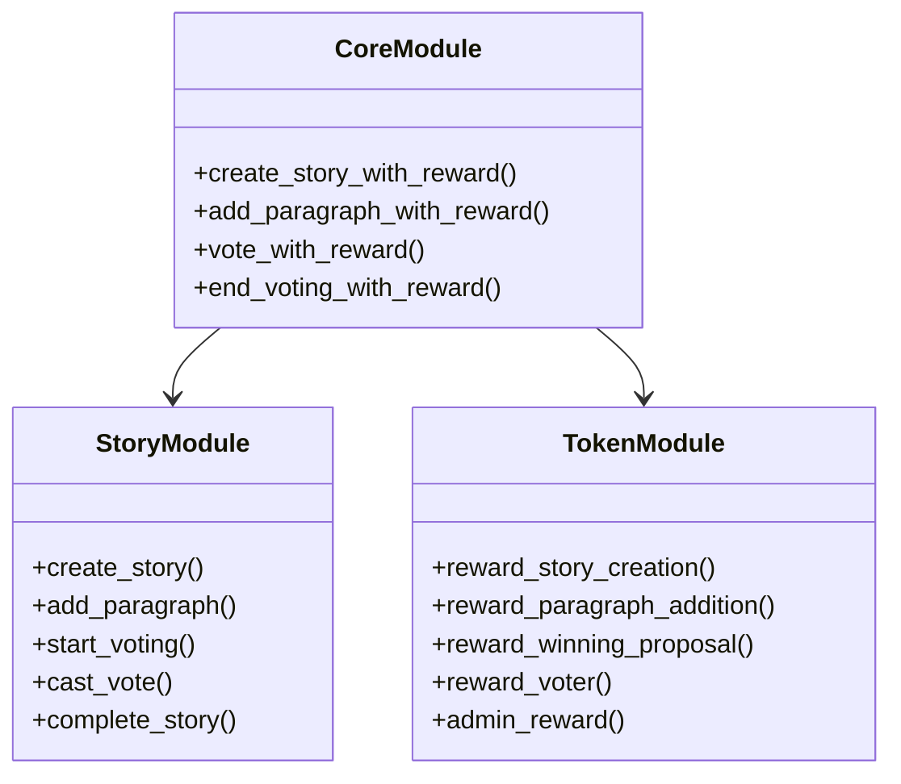

### 数据模型（2024-04-21最新结构）

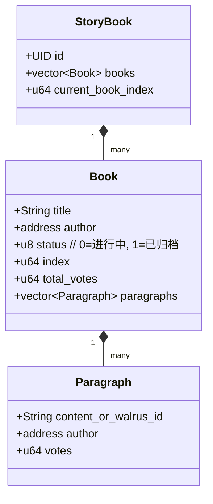

#### 结构说明
- **StoryBook**：全局唯一对象，管理所有 Book，current_book_index 指示当前活跃书本。
- **Book**：一本协作小说，包含标题、作者、状态、段落列表等。
- **Paragraph**：单个段落，链上仅存 walrus_id（或内容哈希），正文链下存储，votes 记录投票数。

#### 主要变更
- 段落正文不再直接存链上，链上仅存 walrus_id 或内容哈希，正文存于 Walrus，极大降低 gas 消耗。
- 投票、归档等元数据链上管理，保证流程公开透明。
- 合约接口全部采用 entry fun，便于前端直接调用。

### 主流程
1. **创建新书**：调用 start_new_book，链上生成 Book 元数据。
2. **添加段落**：前端先上传正文到 Walrus，获得 walrus_id，再调用 add_paragraph，将 walrus_id 及作者地址写入链上。
3. **投票**：用户对段落投票，vote_paragraph 增加 votes 计数。
4. **归档**：投票/段落数满足条件后，archive_book 归档当前 Book，current_book_index 归零，前端可自动开启新书。

---

## 5. Walrus存储策略（2024-04最新原理）

### 设计原则
- **链上存元数据，链下存正文**：链上只存 walrus_id（或内容哈希），正文内容全部存储于 Walrus，既保证内容可验证，又极大降低链上成本。
- **内容哈希校验**：前端上传内容到 Walrus 前，先计算内容哈希，链上可存储哈希值用于一致性校验，防止内容被篡改。
- **内容可追溯**：每个段落的 walrus_id 唯一，用户可通过专属 URL 访问原文。

### 数据流与安全性
1. **内容上传**：用户在前端输入正文，前端计算哈希并上传到 Walrus，获得 walrus_id。
2. **链上登记**：前端调用合约，将 walrus_id、作者地址、内容哈希等写入链上 Paragraph。
3. **内容校验**：任何人可通过链上哈希与 Walrus 返回内容比对，验证内容未被篡改。
4. **内容访问**：通过 narrflow.wal.app/[walrus_id] 直接访问段落原文。

### 优势
- **极低链上存储成本**：正文链下存储，链上只存索引和哈希。
- **内容可验证**：链上哈希+链下内容，保证内容完整性和不可抵赖。
- **高可用性**：Walrus 多节点分布式存储，内容永不丢失。
- **用户体验佳**：内容访问速度快，支持专属页面和 SuiNS 域名。

### 典型场景
- **协作创作**：每个段落链上登记，正文链下存储，投票和奖励链上透明可查。
- **内容追溯**：任何人可通过链上数据和 Walrus 校验内容真伪。
- **归档与检索**：已归档书本和段落可随时检索和访问。

---

## 6. 代币经济

### NARR代币奖励系统

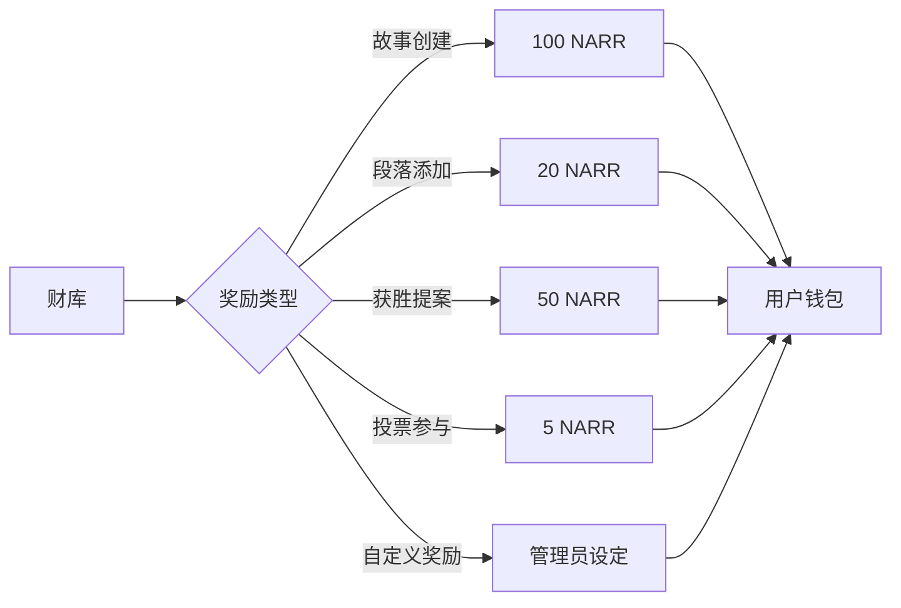

### 代币分配

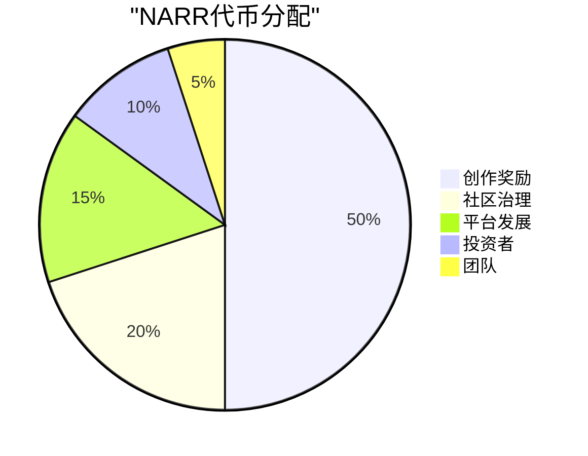

---

## 7. 用户流程

### 故事创建流程

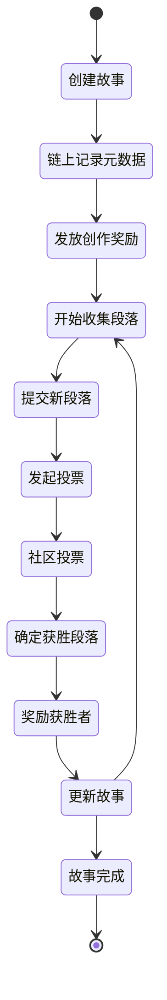

### 用户参与激励循环

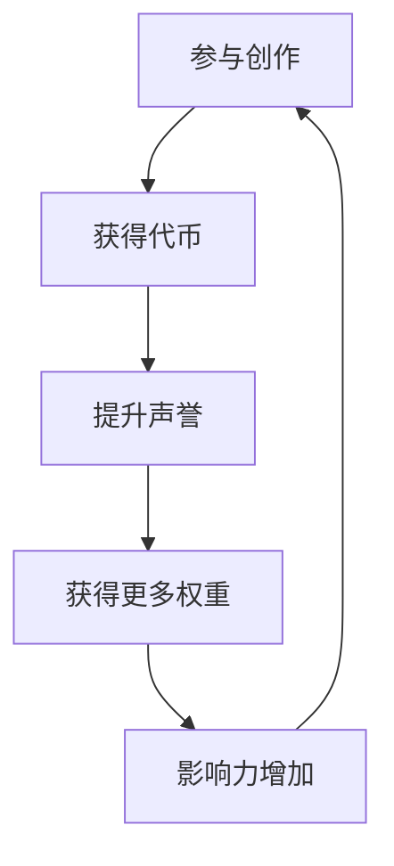

---

## 8. 未来发展

### 路线图

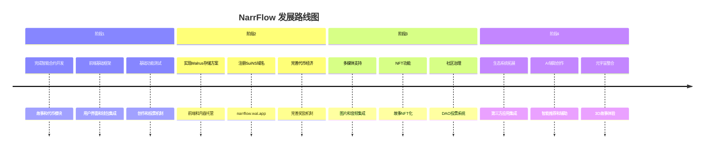

### 存储策略演进计划

**短期**：部署基础Walrus存储
- 前端部署到Walrus Sites
- 段落内容存储在Walrus

**中期**：强化Walrus集成
- 为每个故事创建专属Walrus Site页面
- 实现动态内容展示

**长期**：高级Walrus功能
- 开发自定义Walrus门户
- 建立NarrFlow专用存储协议

---

## 开发者看法与实现逻辑

### 技术选择理由

1. **为何选择Sui生态系统**：
   - Move语言的安全性和资源导向设计非常适合管理数字资产
   - Sui的高吞吐量和低交易费用适合频繁交互的叙事平台
   - 丰富的生态系统工具，如Walrus和SuiNS，提供完整解决方案

2. **为何选择Walrus而非其他存储**：
   - 原生Sui集成，无需跨链操作
   - Walrus Sites提供无服务器前端托管
   - 高数据可用性保证，解决内容持久性问题
   - 可以实现为每个故事/段落创建专属可访问页面

3. **模块化设计逻辑**：
   - 故事模块专注于叙事内容和投票逻辑
   - 代币模块管理激励系统
   - 核心模块整合功能，提供简化的用户体验

### 实现挑战与解决方案

1. **内容管理**：
   - 挑战：平衡链上存储成本与内容完整性
   - 解决方案：链上仅存储Walrus ID和内容哈希，实现高效验证

2. **投票机制**：
   - 挑战：确保投票公平性和激励参与
   - 解决方案：链上投票结合代币奖励，创建正反馈循环

3. **用户体验**：
   - 挑战：简化区块链交互复杂性
   - 解决方案：Walrus Sites提供类似传统Web应用的体验

### 部署建议

1. 首先部署故事和代币智能合约
2. 使用site-builder将前端部署到Walrus Sites
3. 注册SuiNS域名(narrflow.wal.app)
4. 实现段落内容上传到Walrus的功能
5. 开发专属故事页面的路由和渲染逻辑

### 系统安全考量

1. **内容验证**：
   - 使用哈希验证确保内容完整性
   - Walrus多节点存储保障数据安全

2. **权限控制**：
   - 故事作者拥有特定控制权限
   - 使用Sui的所有权模型管理资源

3. **审计**：
   - 所有操作产生链上事件便于追踪
   - 投票过程完全透明

---

总结：Walrus存储解决方案为NarrFlow提供了理想的技术基础，既保持了区块链的核心价值（去中心化、透明、不可篡改），又解决了内容存储的挑战。通过Walrus Sites，我们可以为用户提供无缝体验，同时确保内容的持久可访问性。 